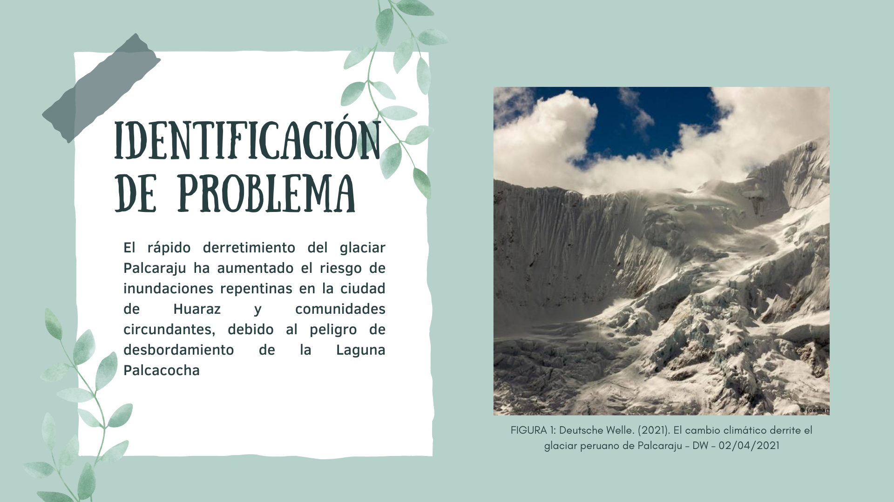
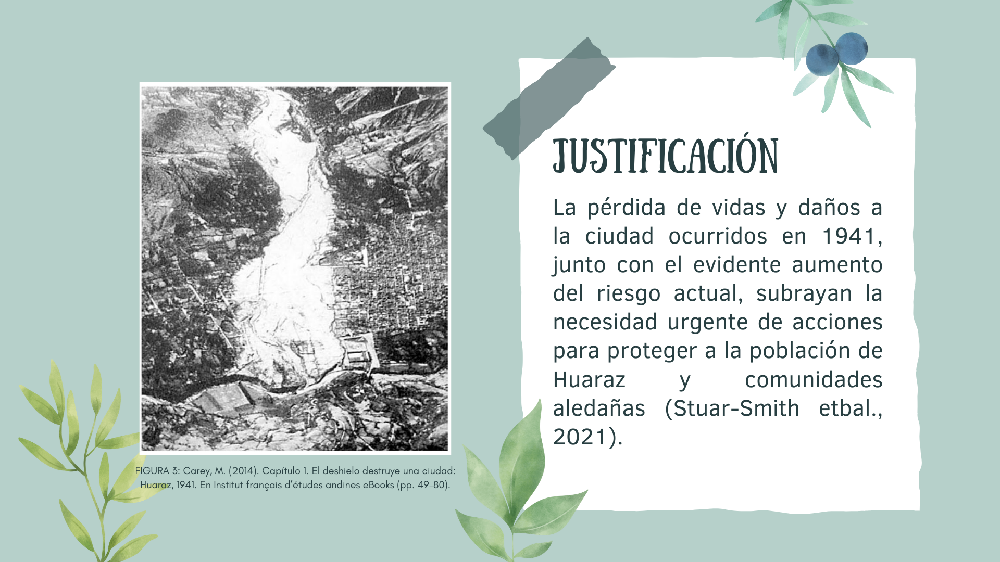
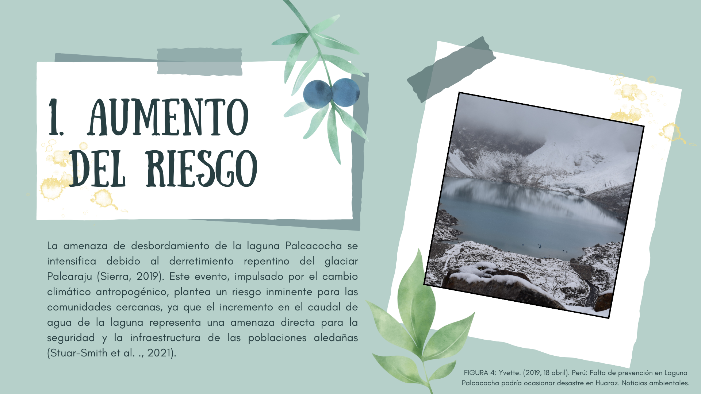
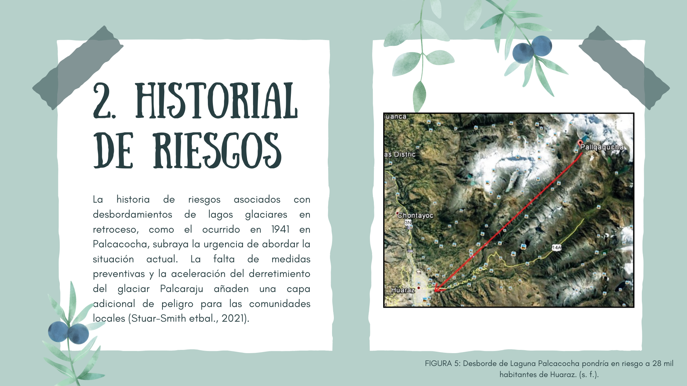
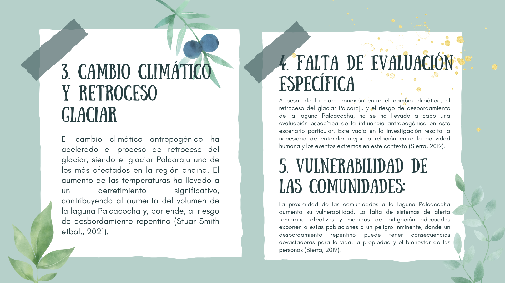
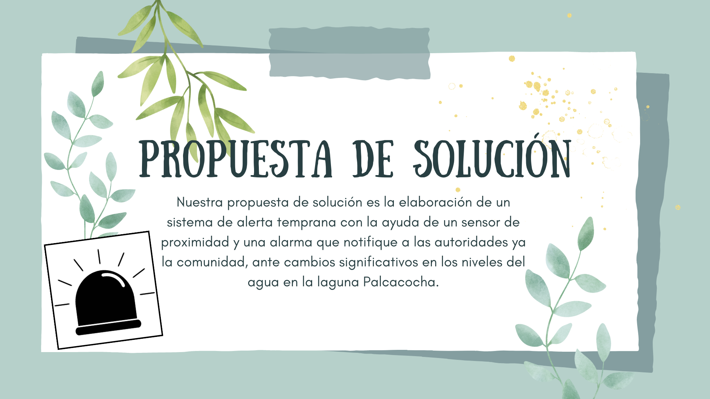
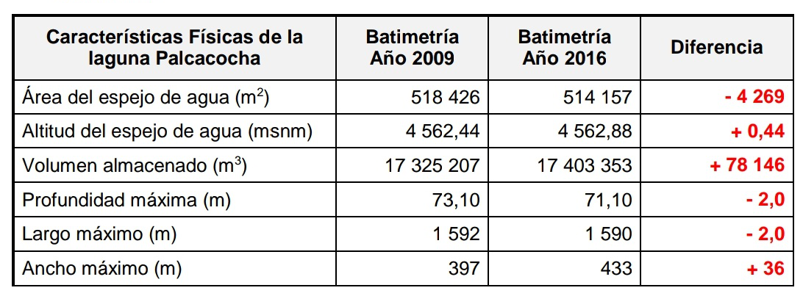

<h1>Definicion del Problema y Usuario</h1>
<h2>Problematica: Riesgo inminente por un desastre natural ante el desbordamiento de la laguna Palcacoha por el derretimiento del nevado Palcaraju</h2>

<b>FIGURA 1:</b> Deutsche Welle. (2021). El cambio climático derrite el glaciar peruano de Palcaraju – DW – 04/02/2021

 
## Datos metereologicos:
La laguna Palcacocha, situada a una altitud de 4,562 metros en la Cordillera Blanca, ha experimentado notables cambios en su carga a lo largo del tiempo. Según estudios batimétricos realizados en 1972, 2009 y 2016, se revela un drástico aumento en su volumen, pasando de 514,800 m³ a 17,325,207 m³ y luego a 17,403,353 m³, respectivamente. Este incremento no solo se manifiesta en la carga total, sino también en otros aspectos fundamentales de la laguna. Su superficie de espejo de agua ha experimentado un crecimiento significativo, aumentando de 62,600 m² en 1972 a 518,426 m² en 2009 y manteniéndose en 514,157 m² en 2016. Estos cambios reflejan el dinámico proceso de desarrollo de la laguna, destacando su evolución en términos de volumen y superficie a lo largo de las décadas (Del Agua Dirección De Conservación Y Planeamiento De Recursos Hídricos Unidad De Glaciología Y Recursos Hídricos, 2016).

<b>Tabla de datos 1:</b> 

Fuente: UGRH - Batimetría de La Laguna Palcacocha 

<b>Tabla de datos 2:</b>

Fuente: UGRH - Batimetría de La Laguna Palcacocha 

## Parámetros metereologicos

<ul>
<li><b>Temperatura: </b>La temperatura del aire y del agua puede afectar la cantidad de precipitación y la rapidez con la que se derrite el glaciar Palcaraju, lo que influye directamente en la Laguna Palcacocha. Ademas las altas temperaturas pueden acelerar el deshielo de glaciares y la fusión del glaciar, aumentando el riesgo de inundaciones.</li>
<li><b>Humedad: </b>La humedad atmosférica influye en la formación de nubes y la intensidad de las precipitaciones. Altos niveles de humedad pueden indicar condiciones propicias para lluvias intensas.</li>
<li><b>Nivel de Agua: </b>Monitorear el nivel de la Laguna Palcacocha, es esencial para detectar aumentos repentinos que podrían indicar riesgo de desbordamiento. Ya que estos niveles de agua altos pueden ser causados por precipitaciones intensas o deshielo rápido.</li>
</ul>

## ¿Por qué estos parametros?
Seleccionar parámetros cómo temperatura, humedad y nivel de agua es crucial para prevenir desastres naturales  originados  por inundaciones de lagunas. 
Estos parámetros proporcionan información valiosa sobre las condiciones atmosféricas y el comportamiento de la Laguna Palcacocha, lo que puede ayudar en la identificación temprana de situaciones de riesgo y en la implementación de medidas preventivas.

### Conclusiones Urgentes:
La combinación de factores como el cambio climático acelerado, el derretimiento repentino del glaciar Palcaraju y la falta de evaluación específica crea una situación de emergencia. Se requieren acciones inmediatas para comprender y abordar la amenaza que representa el desbordamiento de la laguna Palcacocha para las comunidades circundantes, protegiendo así vidas.
## Usuario
Comunidad de Huaraz
<h1>Herramientas usadas para identificar el problema</h1>

<h2>1. Mapa de Empatia</h2>

<h2>2. Mapa de Viaje del cliente</h2>

<h2>3.Diagrama Causa - Efecto </h2>

 
 
<h2>Bibliografia</h2>
<ul>
  <li>Autoridad Nacional del Agua [ANA]. (4 de julio de 2020). Perú perdió el 51% de sus glaciares debido al cambio climático.</li>
  <li>Del Agua Dirección De Conservación Y Planeamiento De Recursos Hídricos Unidad De Glaciología Y Recursos Hídricos, A. N. (2016, 1 febrero). Batimetría de la Laguna Palcacocha</li>
  <li>Ferro, V. (2009). La evaluación del riesgo de desastre en la planificación del desarrollo de la ciudad de Huaraz, Áncash. ANÁLISIS DEL RIESGO, 145.</li>
  <li>Gonzales Lizarme, G. (2022). Simulación de la amenaza de avalancha y su riesgo físico sobre la laguna Palcacocha en la microcuenca Paria, Huaraz, 2016-2017.</li>
  <li>Moreno, C., Aquino, R., Ibarreche, J., Pérez, I., Castellanos, E., Álvarez, E., Rentería, R., Anguiano, L., Edwards, A., Lepper, P., Edwards, R. M., & Clark, B. (2019). RiverCore: IoT device for river water level monitoring over cellular communications. Sensors (Basel, Switzerland), 19(1), 127.</li>
  <li>Sierra, Yvette. (26 de marzo de 2019). Perú: falta de prevención en Laguna Palcacocha podría ocasionar desastre en Huaraz. Mongabay.</li>
  <li>Stuart-Smith, R. F., Roe, G. H., Li, S., Allen, M. R. (2021). Increased outburst flood hazard from Lake Palcacocha due to human-induced glacier retreat. Nat. Geosci., 14, 85-90.</li>
  <li>Valderrama Murillo, P. A., Pari Pinto, W., Silva Espejo, R. C., & Fídel Smoll, L. (2013). Evaluación ingeniero-geológico: Laguna de Palcacocha y su influencia en la ciudad de Huaraz Cordillera Blanca. Región Ancash.</li>
</ul>

<a href="README.md">Enlace al README de Entregables</a>
