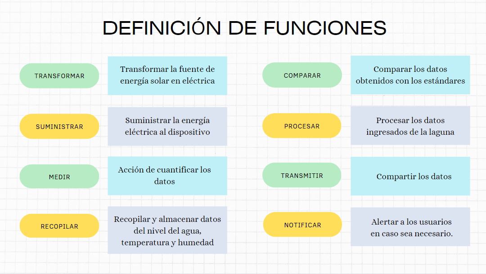
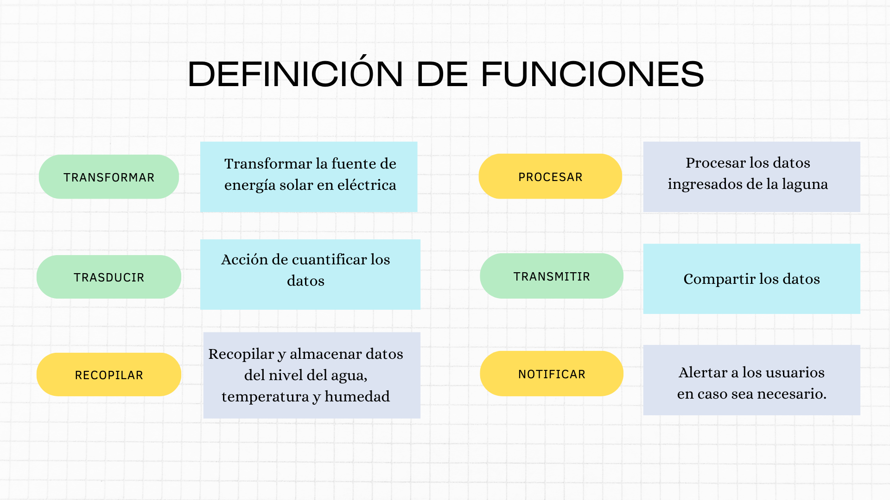

<h1 align="center">CAJA NEGRA Y ESQUEMA DE FUNCIONES</h1>
<h2>1. PROPUESTA DE SOLUCION: Sistema de Alerta Temprana</h2>

Nuestra propuesta de solución implica el desarrollo de un dispositivo equipado con sensores de humedad, temperatura y nivel del agua. Este dispositivo será fundamental para proteger a la población de Huaraz al proporcionar información crucial sobre las condiciones ambientales y los niveles de agua en tiempo real. Con la capacidad de monitorear estos parámetros de manera continua, el dispositivo permitirá una alerta temprana en caso de condiciones climáticas extremas o un aumento repentino en el nivel del agua, lo que ayudará a prevenir desastres naturales y a proteger la vida y la propiedad de los residentes de Huaraz.

<h2>2. CAJA NEGRA</h2>

<h2>3. ESQUEMA DE FUNCIONES</h2>

<h2>4. DEFINICION DE FUNCIONES</h2>

