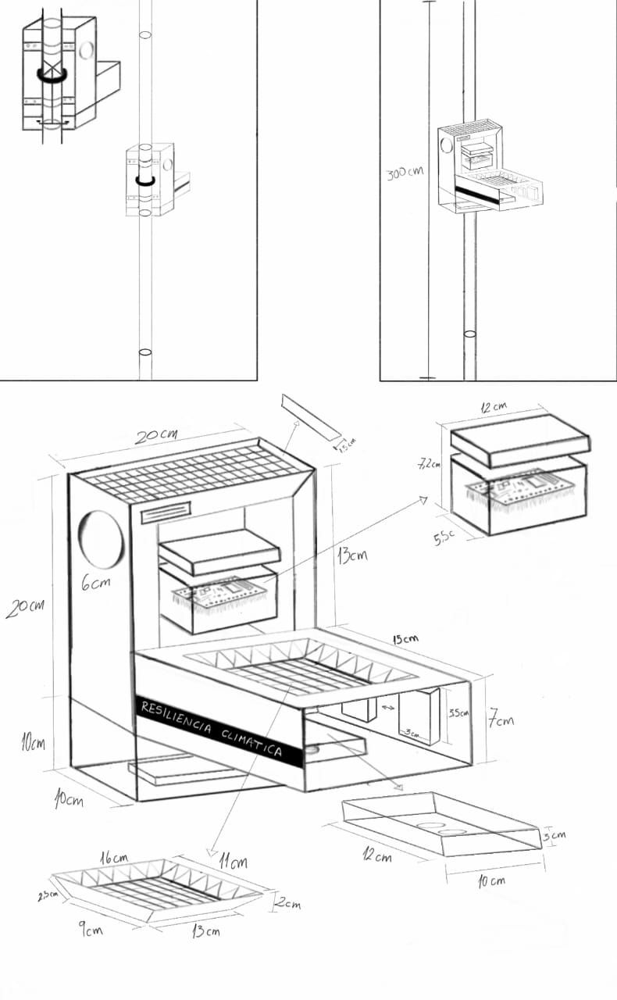
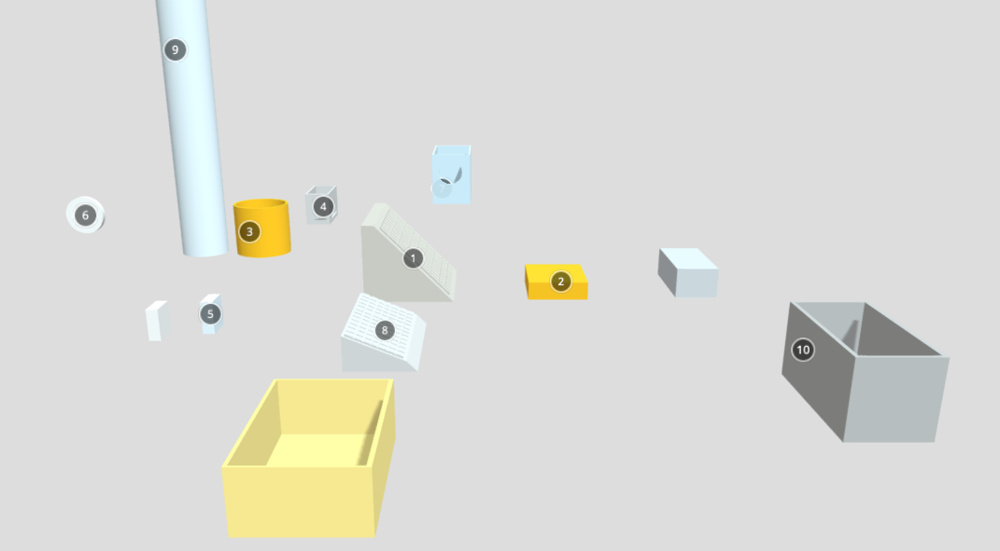
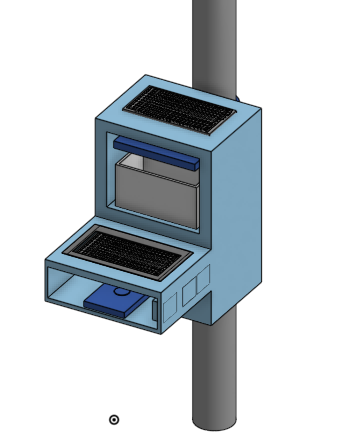
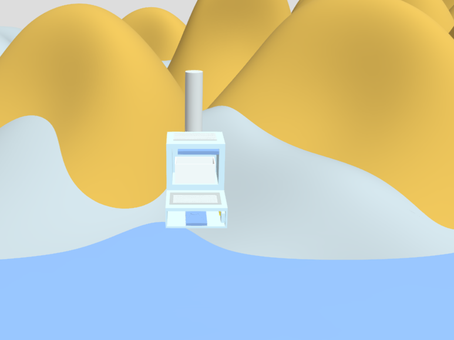

<h1 align="center">MODELO 3D</h1>
<h2 align="center">Proyecto preliminar 1</h2>

<h2 align="center">Medidas del proyecto</h2>

<h2 align="center">Modelado 3D (Partes)</h2>

<a href="https://sketchfab.com/models/0cfd7786ea6c4c309e18a19b6a26dcf2/embed">Link a Modelo 3D</a>

<h2 align="center">Modelado 3D unido</h2>

<a href="https://sketchfab.com/models/90330fd6661c43fd96191540ab513f41/embed">Link a Modelo 3D</a>

<h2 align="center">Modelado 3D unido al pie de la laguna</h2>

<a href="https://sketchfab.com/models/65a34cf6ce494d07ad861f97edeb374d/embed">Link a Modelo 3D</a>

<a href="https://cad.onshape.com/documents/a6c103d0464ad5d797923d95/w/203fb7d81aefc219e3fea525/e/9d936514819bcfc9726a6542?renderMode=0&uiState=65c051fdfacf1843878ee83a">Link al Onshape</a>
