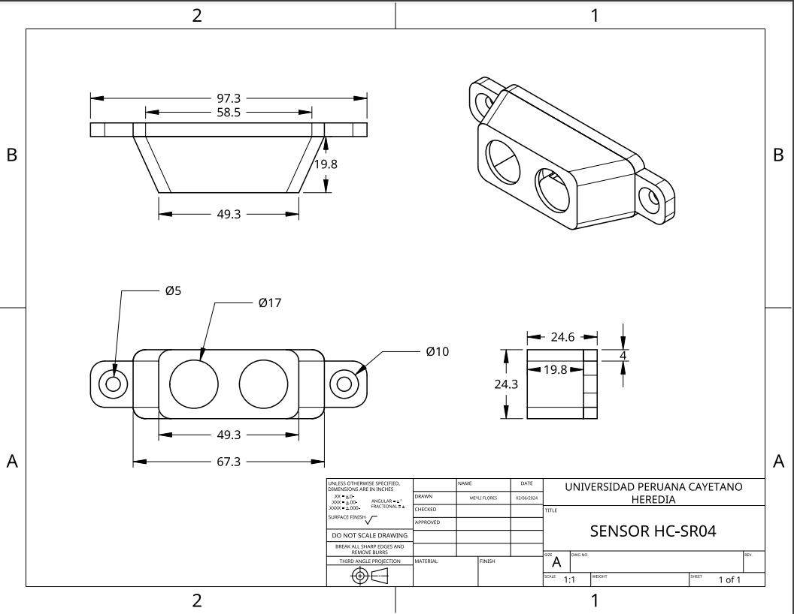
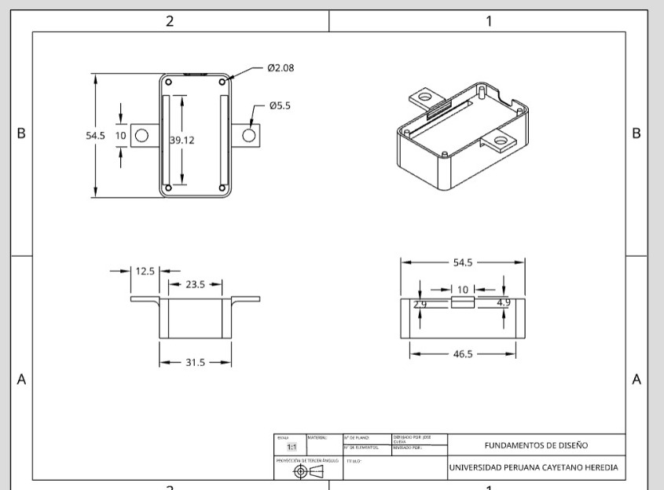
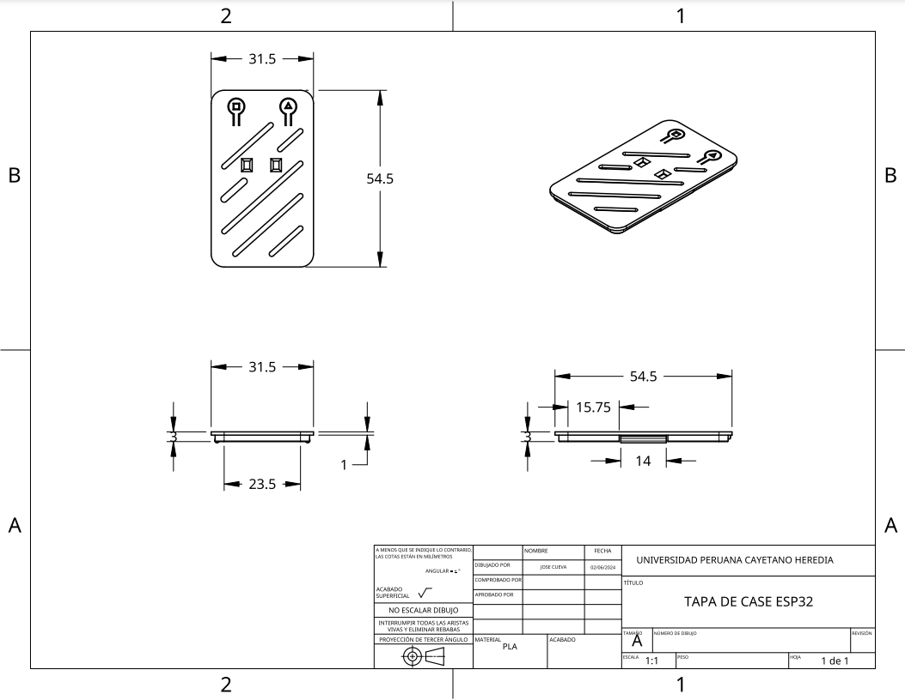

<h1>PLANOS DE MODELO 3D</h1>
<h2 align="center">Plano para el case general del prototipo</h2>

<h2 align="center"> Plano para el case del sensor DHT22</h2>

<a href="../../Hardware/Descargables/Plano_DHT22.pdf">Link al plano en pdf</a>

<h2 align="center">Plano del case para el sensor HC SR04</h2>

<a href="../../Hardware/Descargables/Plano HC-SR04.pdf">Link al plano en pdf</a>

<h2 align="center">Plano de case para ESP32</h2>

<h2 align="center">Plano de la tapa para case para ESP32</h2>

<a href="../../Hardware/Descargables/TAPA CASE ESP 32.pdf">Link al plano en pdf</a>
