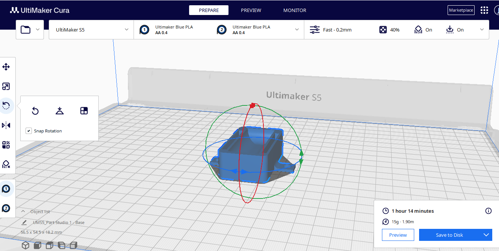
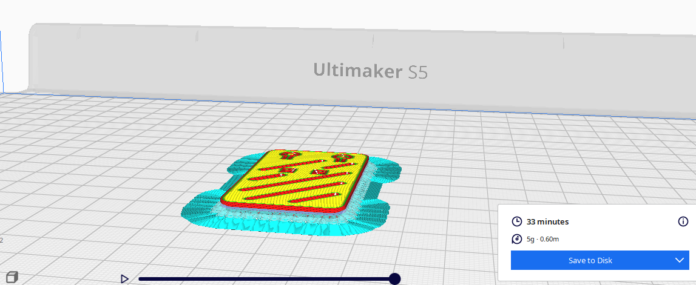
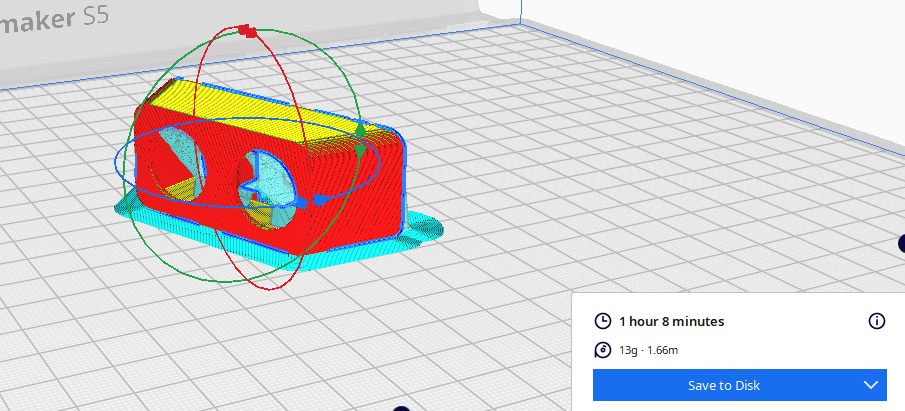
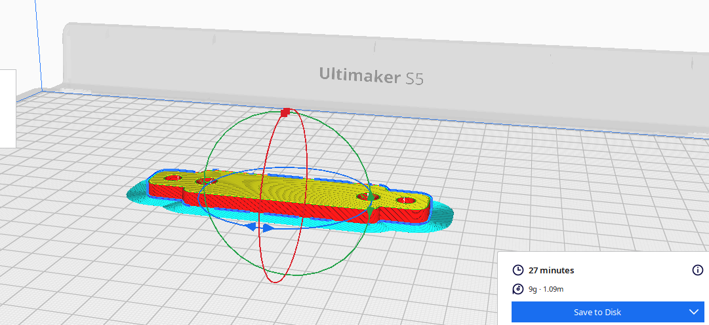
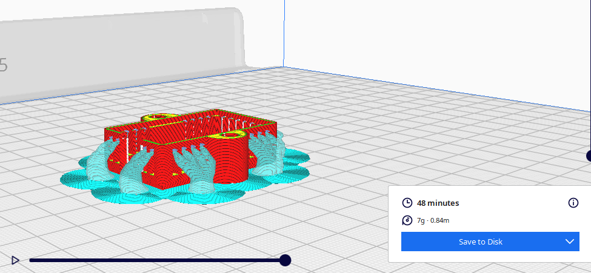
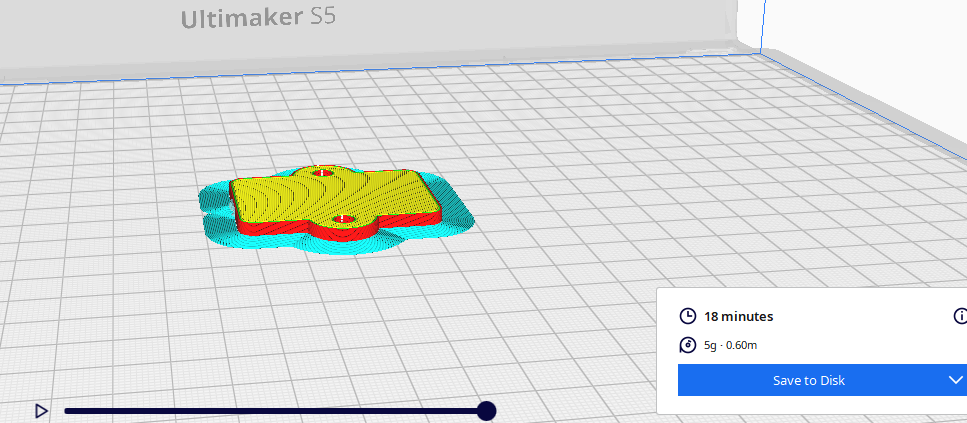

<h1>PLANOS DE MODELO 3D</h1>
<h2 align="center">Plano para el case general del prototipo</h2>

<h2 align="center"> Plano para el case con soporte</h2>

<h2 align="center"> Plano para el case del sensor DHT22</h2>

<a href="../../Hardware/Descargables/Plano_DHT22.pdf">Link al plano en pdf</a>

Extraido de Onshape Publico Autor:Kay Albrecht<a href="https://cad.onshape.com/documents/425029353d0aa777419d6583/w/8bddf8ac0075531a7c73b0bb/e/d72d94bc0248795d531fad0a">(Link)</a>

<h2 align="center">Plano para el case del sensor HC SR 04</h2>

<a href="../../Hardware/Descargables/Plano HC-SR04.pdf">Link al plano en pdf</a>

Extraido de Onshape Publico Autor:Viljami Pirttimaa<a href="https://cad.onshape.com/documents/0da1b14fdb685c8fc693bb72/w/bcf866a470bfee3de3fb9394">(Link)</a>

<h2 align="center">Plano de case para ESP32</h2>

Extraido de Printables Autor:bkgoodman<a href="https://www.printables.com/es/model/50035-esp32-devkit-v1-chunky-case">(Link)</a>

<h2 align="center">Plano para la tapa del case ESP32</h2>

<a href="../../Hardware/Descargables/TAPA CASE ESP 32.pdf">Link al plano en pdf</a>

Extraido de Printables Autor:bkgoodman<a href="https://www.printables.com/es/model/50035-esp32-devkit-v1-chunky-case">(Link)</a>

<h2 align="center">Case del sensor HC-SR-04(Ultramaker Cura)</h2>

<h2 align="center">Case del sensor DHT22(Ultramaker Cura)</h2>

<h2 align="center">Plano para el case del sensor DHT22(Ultramaker Cura)</h2>

