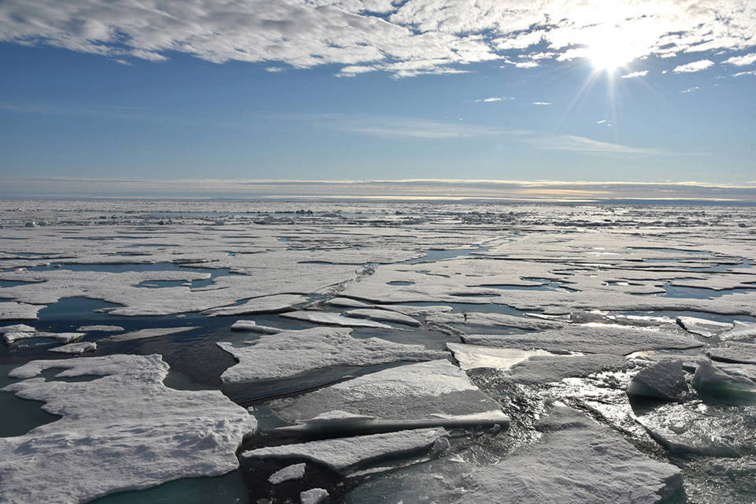
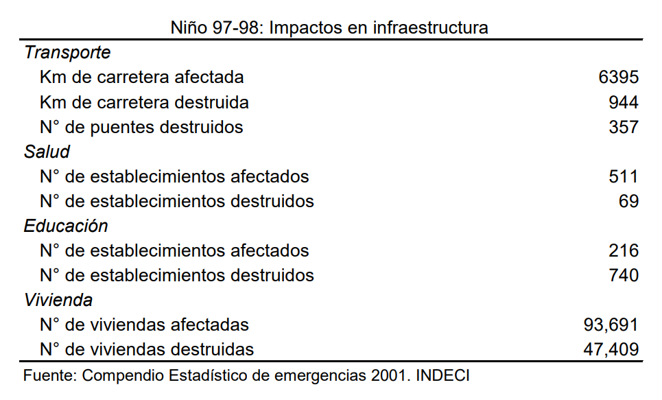

<h1>Explicacion del Contexto Social y Economico</h1>

<h2>1. Contexto Social</h2>
<h3>1.1 A Nivel Mundial</h3>

A nivel global, el derretimiento de glaciares, genera la reducción de recursos hídricos para consumo y riego, afectando a gran parte de  las personas, así como un descenso en la generación de energía hidroeléctrica. El deshielo de los glaciares no solo provoca un aumento en el nivel del mar, sino que también incrementa significativamente la vulnerabilidad  a diversos desastres naturales, incluyendo crecidas impredecibles de lagos glaciares y el consiguiente arrastre de residuos (Peralta,2019) . Por esta razón, es imperativo tener un conocimiento detallado sobre la rapidez a la que los glaciares están perdiendo masa, con el fin de implementar medidas de manera inmediata.

 FIGURA 1: Entre 60 y 90% del agua dulce de todo el planeta está congelada en la Antártida/ Revista NATURE

 

En el 2018, un informe realizado por la revista Nature concluyó que aproximadamente 4 millones de personas, lo que representa el 70% de las bases presentes en el Ártico, como instalaciones de extracción de combustibles fósiles(petróleo y gas), enfrentan actualmente amenazas debido al deshielo en la zona.(Karjalainen, Aalto, 2018)
En Rusia, el 65% de la superficie está envuelta por permafrost(capa de suelo permanentemente congelada), quedando la ciudad de Yakutsk  como la mayor urbe edificada sobre esta área, donde la temperatura ha aumentado en +2,5 °C en los últimos 10 años. Para afrontar este cambio, muchas viviendas en esta ciudad, que alberga a 300,000 habitantes, se vieron obligados a usar paneles de hormigón en sus construcciones, sostenidos por pilotes, para garantizar  que debajo de las estructuras haya buena corriente de aire, para evitar el calentamiento del suelo ( Karjalainen, Aalto, 2018)

<h3>1.2 A Nivel Regional</h3>
<h4>ECUADOR</h4>

Los glaciares ubicados en el ecuador sirven como indicadores de los cambios climáticos experimentados en la actualidad. Estos glaciares responden rápidamente a las variaciones en las condiciones climáticas, y debido a la elevada altitud en la que se encuentran, presentan extensiones considerables de cobertura glaciar, medidas en kilómetros cuadrados. En los últimos años, estos glaciares han experimentado una disminución evidente en su cobertura, observable a simple vista (Salas & Duarte, 2018).

El Nevado Antisana, actualmente ha disminuido su extensión, este retroceso está relacionado con el cambio climático global, donde el deshielo se ha prolongado por meses, produciendo un aumento en el caudal de los ríos cercanos a Quito, sin embargo se prevé que en la siguiente década se triplique, ya que en los Alpes y Andes tropicales, se masifica la  la desglaciación (Vuille,2008). Cabe resaltar que durante el período 1995-2006 el glaciar tuvo un mayor índice de descongelamiento (Vauchel,2005).

 

FIGURA 2: El volcán Antisana se alza sobre las nubes, es el más grande de Ecuador/ EL PAÍS

 

 Los glaciares tropicales responden a los cambios climáticos muy rápido, por lo que si continúa disminuyendo este el hielo que tiene este volcán, las consecuencias para Quito serían negativas, puesto que esta, es la fuente que alimentan los suministros de hídricos para abastecer de agua potable a la población (Vauchel,2005).

<h3>1.3 A Nivel Nacional</h3>
Nuestro país debido a su ubicación geográfica está ubicado dentro del cinturón tropical del planeta por lo que los cambios climáticos son más evidentes, y es por ello que el 71% de los glaciares de este tipo está en Perú. (Suarez,2015) 
Según Vuille(2008) la temperatura en la cordillera blanca del Perú paso de 0.35 a 0.39 grados centígrados entre los años de 1951 a 1999. En la región de Puno está ubicado un gran nevado llamado Allincapac, situado en la Cordillera de Carabaya, específicamente en el distrito de Macusani, provincia de Carabaya, en Puno. Similar a diferentes glaciares de la cordillera puneña, este nevado experimenta cambios atribuibles al cambio climático. El ecosistema de Allincapac alberga una diversidad de ambientes con superficies rocosas, que presentan grietas y fisuras que permiten la filtración de agua proveniente del deshielo. (Montoya, 2009).

 

FIGURA 3: Imagen satelital del nevado Allincapac, Una laguna fria y solitaria, Camino hacia Ollachea octubre del 2015

 

De acuerdo con los resultados obtenidos por Pacompia Vilca (2022), se concluye que durante el año 2020, el contorno glaciar del nevado Allincapac era de 1011.33 hectáreas, indicando una disminución gradual a lo largo del tiempo. La diferencia de cobertura glaciar entre los años 2000 y 2020 revela una pérdida total de 1650.92 hectáreas.

Asimismo, según los datos recopilados, en el año 2000 la cobertura glaciar alcanzaba las 2665.25 hectáreas. A lo largo de los siguientes periodos, se observa un retroceso significativo: de 2000 a 2005, se perdió una extensión de 816.55 hectáreas, siendo este periodo crítico. Entre 2005 y 2010, la pérdida fue de 207.77 hectáreas; de 2010 a 2015, la pérdida fue de 257.95 hectáreas; y finalmente, de 2015 a 2020, se perdió una extensión de 371.65 hectáreas. La suma total desde el año 2000 hasta 2020 revela una pérdida de 1653.92 hectáreas, dejando solo 1011.33 hectáreas de cobertura glaciar en 2020. Esta disminución glaciar se atribuye al aumento de las temperaturas.

En el Nevado Huascarán, la montaña más alta de los Andes peruanos, se originaron avalanchas notables en 1970 y 1962. Estos sucesos se atribuyen al deshielo de la nieve presente y la liberación de la humedad del suelo, propia del lugar (Plafker & Ericksen, 1978).

<ul>
<li>En 1970, los efectos del cambio climático fueron evidentes en este hecho, puesto que se desencadenó un terremoto, y con ello el desplazamiento de masas glaciares con un volumen de 50 a 100 millones de metros cúbicos y causó alrededor de 18,000 muertes, principalmente en Yungay.</li>
<li> La de 1962, con un volumen de aproximadamente 13 millones de metros cúbicos, resultó en alrededor de 4,000 muertes, principalmente en Ranrahirca. </li>
</uk>

 

FIGURA 4: Imagen del nevado Huascarán

Actualmente, existe una  fisura en la capa de hielo en el Nevado, por que las zonas aledañas siguen siendo vulnerables, por la inestabilidad y riesgo de avalanchas en cualquier momento, puesto que se ha agudizado el deslizamiento de hielo, aumentando el caudal de los Ríos Santa Santa y Ranrahirca. (Evans,2009)

 
<h2>2. Contexto Económico</h2>
<h3>2.1 A Nivel Mundial</h3>

En las últimas décadas, el calentamiento global ha tenido consecuencias devastadoras, especialmente acentuadas en las regiones polares. Las evaluaciones satelitales indican que los glaciares de Groenlandia y la Antártida están disminuyendo a una tasa anual de 125 mil millones de toneladas (Vargas, 2009).

El deshielo tiene repercusiones a nivel global, incluida la posibilidad de la desaparición de ciudades y el trastorno de los ecosistemas. Esto genera un flujo migratorio descontrolado que desestabiliza la economía debido a la escasez de recursos. El impacto económico resultante del desequilibrio de los ecosistemas provocará un aumento en los desastres naturales, así como la aparición de refugiados climáticos y comunidades dependientes de recursos escasos (Peralta, 2020).

En Europa, las inundaciones son la catástrofe natural más común, representando el 43% de todas las catástrofes entre 1998 y 2002, con pérdidas económicas que superan los 25.000 millones de euros (EEA, 2005). En España, las pérdidas económicas anuales debido a la sismicidad e  inundaciones alcanzan los 760 millones de euros en el periodo 1987-2001, siendo las inundaciones el principal peligro natural (Olcina, 2009).

Por lo tanto, es crucial implementar acciones para reducir la necesidad de adaptación de los países frente al cambio climático. De lo contrario, los costos de adaptación podrían ser considerablemente significativos. El quinto informe del Panel Intergubernamental sobre Cambio Climático ( IPCC) menciona que estos costos pueden superar los 100 mil millones de dólares anuales a partir de 2050. Asimismo, el Adaptation Gap Report del (PNUD) en 2014 advierte que estos costos podrían triplicarse si no se toman medidas inmediatas (Rodríguez y Mance, 2009).

De acuerdo con informes de la NASA, a nivel global, la temperatura promedio de la superficie del océano ha aumentado en 0,01°C por año durante el período de 1900 a 2007. En 2007, la temperatura media mundial se elevó en 0,60°C en comparación con el año 1900 (Vargas, 2009).

GRAFICO 1

<h3>2.2 A Nivel Regional</h3>

Las regiones más afectadas incluyen aquellas con sectores productivos altamente sensibles a los cambios ambientales, como África, el Sur, el Sudeste de Asia y América Latina (Vargas, 2009). En latinoamérica, la Comisión Económica para América Latina y el Caribe (CEPAL) afirma que las principales amenazas hidrometeorológicas en la región son inundaciones, deslizamientos de tierra, huracanes y sequías (CEPAL, 2003). Estudios adicionales indican que el costo de estos desastres alcanza aproximadamente los 250 mil millones de dólares entre los años de 1972 a 2005, con una estimación de 250 mil millones de dólares para los años 2000 y 2010 (Zapata, 2006).

En los países latinoamericanos, las inundaciones relacionadas con el deshielo de glaciares afectan significativamente. En Argentina, por ejemplo, los productores agrícolas identifican las inundaciones, las heladas y el granizo como eventos perjudiciales, siendo las inundaciones más destructivas (Riverola, 2002). La provincia de Córdoba-Argentina, abarca alrededor de 16.532.100 hectáreas, con un 83% dedicado a actividades agrícolas y contribuye con aproximadamente el 14% del producto interno bruto en el país (Gay, 2006).

El Estudio de Impactos Económicos del Cambio Climático realizado en  Colombia advierte que la falta de adaptación a estos cambios tendrá consecuencias significativas en la economía nacional (DNP-BID, 2014). Sectores como la agricultura, ganadería, pesca, forestal y transporte, que contribuyen con el 4,3% del PIB actual, necesitan proporcionar servicios ecosistémicos, recursos hídricos y especies nativas. Por ello, se estima que entre 2010 y 2100 podrían generarse pérdidas económicas similares a 3,7 veces el PIB actual (DNP-BID, 2014).

Estas pérdidas son equivalentes a como si Colombia sufriera cada cuatro años impactos económicos similares a los ocurridos durante La Niña en 2010-2011. Este fenómeno podría repetirse a lo largo del tiempo si los sectores no implementan medidas y acciones necesarias para mitigar su vulnerabilidad, es decir, si no se adaptan al cambio climático (Rodríguez y Mance, 2009).

<h3>2.3 A Nivel Nacional</h3>

El impacto principal de la acumulación gradual de gases de efecto invernadero (GEI) se está evidenciando actualmente en nuestro país a través del retroceso glaciar. En los últimos 22 a 35 años, ha ocurrido una pérdida del 22% de la superficie glaciar, equivalente a 7000 millones de metros cúbicos que equivale a 10 años de consumo de agua en Lima. Por otro lado, el retroceso de los frentes glaciares, junto con el aumento en la intensidad de las lluvias, podría dar lugar a la formación de lagunas o glaciares "colgados", incrementando el riesgo de desastres naturales como huaycos, aluviones y rebalses, afectando a las poblaciones de los valles interandinos del país (Vargas, 2009).

Durante la etapa de emergencia y rehabilitación del Niño 98, la inversión destinada a la descolmatación de canales, encauzamiento, diques de ríos, entre otras medidas, alcanzó aproximadamente $168 millones. Además, el costo total de la rehabilitación y reconstrucción de la infraestructura del país, como carreteras, caminos y puentes, ascendió a $685 millones (Conam,2001).

TABLA 1

En consecuencia, el Perú presenta una considerable vulnerabilidad ante cambios climáticos drásticos, poniendo en evidencia las pérdidas económicas asociadas a fenómenos como El Niño. En un escenario pasivo, los efectos del cambio climático podrían ser aún más pronunciados, ya que se potenciarán al involucrarse otros mecanismos que afectan negativamente el crecimiento; como la pérdida de disponibilidad de recursos hídricos (para consumo humano y generación energética) debido al retroceso glaciar (Vargas, 2009).

En síntesis, los impactos del calentamiento global no se limitan al aumento de la temperatura del aire o al ascenso del nivel del mar. También se manifiestan a través de diversos fenómenos meteorológicos causados por el deshielo de glaciares, que van desde el incremento de las corrientes eólicas hasta la alteración de los patrones del tiempo, dando lugar a sequías e inundaciones en diversas zonas, así como a la intensificación del fenómeno de El Niño (Feo, Solano y Beingolea, 2009).

 
 
<h2>3. REFERENCIAS BIBLIOGRÁFICAS</h2>
<ul>
<li>Hjort, J., Karjalainen, O., Aalto, J. et al. La degradación del permafrost pondrá en riesgo la infraestructura del Ártico a mediados de siglo. Nat Comuna 9 , 5147 (2018).</li>
<li> Andrea Peralta Rodríguez (2020). Deshielo: el calentamiento global como proceso gráfico</li>
<li>Vuille, M., & Bradley, R. S. (2008). Mean Annual Temperature Trends and their Vertical Structure in the Tropical Andes. Geophysical Research Letters, 27(23): 3885-3888.</li>
<li>Vauchel, P. (2005). HYDRACCESS: Software for Management & processing of Hydro-meteorological data.</li>
<li>TAUPIN, J. D. Retroceso de glaciares tropicales en América del Sur y evolución de la temperatura en los Andes del Ecuador. Caso nevado Antisana South America Tropical glaciers retreat and temperature evolution in the Ecuadorian Andes. Case of Antisana snow-capped volcano.</li>
<li>Pacompia Vilca, S. E. (2022). Nivel de desglaciación del nevado Allincapac entre los años 2000 y 2020 ubicado en el Distrito de Macusani.</li>
<li>Montoya, H. (2019). Cryophilic communities of the Allincapac mountain glaciers, southern Peruvian Andes, Puno Department: Phenotypic variability of the cyanobacterium Nostoc commune (Nostocales, Nostocaceae).</li>
<li>Vuille, M., Francou, B., Wagnon, P., Juen, I., Kaser, G., Mark, B. G., & Bradley, R. S. (2008). Climate change and tropical Andean glaciers: Past, present and future.Earth-Science Reviews, 89(3-4), 79-96. doi:10.1016/j.earscirev.2008.04.002.</li>
<li>Suarez, W., Macedo, N., Montoya, N., Arias, S., Schauwecker, S., Huggel, C., ... & Condom, T. (2015). Balance enérgetico neto (2012-2014) y evolución temporal del nevado Quisoquipina en la región de Cusco (1990-2010). Revista peruana geo-atmosférica, 4, 80-92.</li>
<li>Hjort, J., Karjalainen, O., Aalto, J. et al. La degradación del permafrost pondrá en riesgo la infraestructura del Ártico a mediados de siglo. Nat Comuna 9 , 5147 (2018). </li>

<li>Plafker, G., & Ericksen, G. E. (1978). Nevados Huascarán Avalanches, Peru. In Developments in Geotechnical Engineering (pp. 277–314).</li>
<li>Evans, S. G., Bishop, N. F., Smoll, L. F., Murillo, P. a. V., Delaney, K. B., & Oliver‐Smith, A. (2009). A re-examination of the mechanism and human impact of catastrophic mass flows originating on Nevado Huascarán, Cordillera Blanca, Peru in 1962 and 1970. Engineering Geology, 108(1–2), 96–118.</li>
<li>Zapata Martí, Ricardo. (2006). Los efectos de los desastres en 2004 y 2005: la necesidad de adaptación de largo plazo. Serie Estudios y Perspectivas. Nº 54. Sede subregional de la CEPAL en México. Punto Focal de Desastres. México, DF. 47 pp. </li>
<li>Peralta, A. (2020). Deshielo. El calentamiento global como proceso gráfico. [Trabajo fin de grado, Universidad Politécnica de Madrid]. Archivo digital UPM</li>
<li>Vargas, P. (2009). El cambio climático y sus efectos en el Perú. Lima: Banco Central de Reserva del Perú.</li>
<li>EEA (2005). El cambio climático y las inundaciones fluviales en Europa. Agencia Europea de Medio Ambiente, Briefing 01.</li>
<li>Olcina, J. (2009). Cambio climático y riesgos climáticos en España.</li>
<li>Conde-Álvarez, C., & Saldaña-Zorrilla, S. (2007). Cambio climático en América Latina y el Caribe: Impactos, vulnerabilidad y adaptación. Ambiente y desarrollo, 23(2), 23-30.</li>
<li>CEPAL, 2003. Panorama Social de América Latina 2002-2003. Pobreza y distribución del ingreso. Santiago de Chile</li>
<li>Rivarola, A. del V., M.G. Vinocur, y R.A.Seiler. (2002). Uso y demanda de información agrometeorológica en el sector agropecuario del centro de Argentina. Revista Argentina de Agrometeorología (RADA), 2 (2): 143-149.</li>
<li>Gay, C., C. Conde, H. Eakin, (Mexico), R: Seiler, M. Vinocur, M. Wehbe (Argentina). (2006). Final Report Project No. LA 29 (2006): Vulnerability and Adaptation to Climate Change: The Case of Farmers in Mexico and Argentina. </li>
<li>CONAM 2001. Primera Comunicación del CONAM 2001</li>
<li>Feo, O., Solano, E., Beingolea, L., Aparicio, M., Villagra, M., José Prieto, M., ... & Silveti, R. (2009). Cambio climático y salud en la región andina. Revista Peruana de Medicina Experimental y Salud Pública, 26(1), 83-92.</li>

</ul>

 
 

<a href="README.md">Enlace al README de Entregables</a>