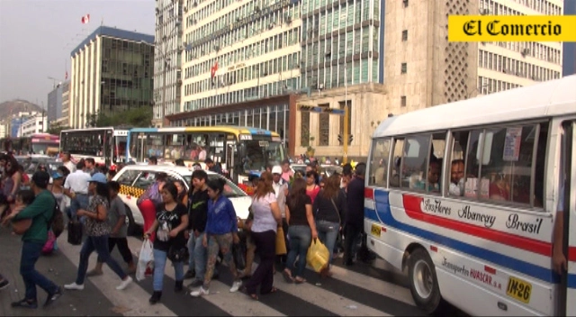
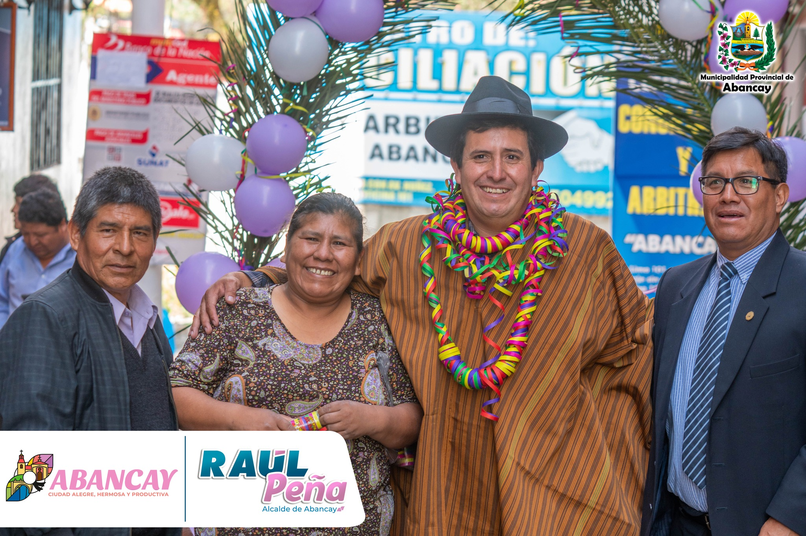
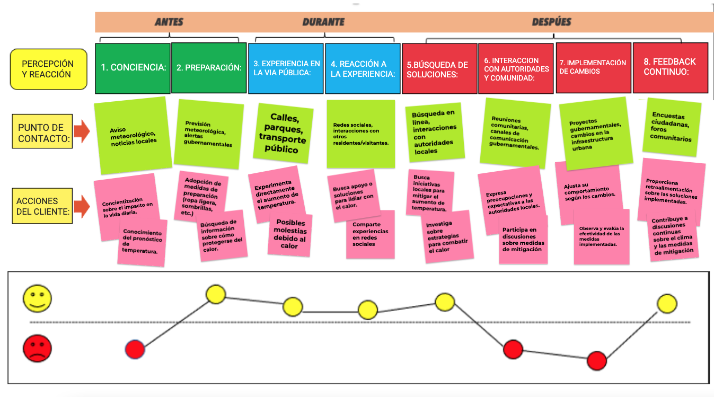
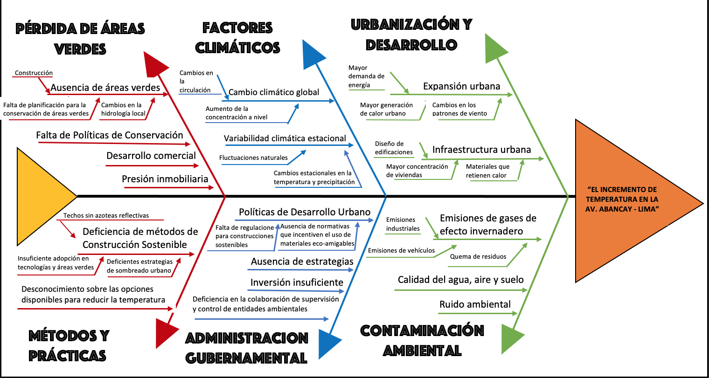

<h1>Entregable 2</h1>
<h2>Problematica</h2>

La Av. Abancay es uno de los lugares mas transitados de Lima Perú puesto que existen áreas comerciales. Asimismo, es visitada por una gran cantidad de personas a diario, esto da origen a la contaminación en dicha zona y se da en evidencia el aumento de temperatura en la Av. Abancay es por ello que nuestro equipo de trabajo busca soluciones innovadoras y sostenibles para poder contribuir en la reducción del “Incremento de temperatura en la Av. Abancay”.

<h2>Usuario</h2>

Comunidad de la Av. Abancay.

<h1>Herramientas usadas para identificar el problema</h1>

<h2>Mapa de Empatia</h2>

<h2>Mapa de Viaje del cliente</h2>

<h2>Diagrama Causa - Efecto </h2>

 
 
<a href="README.md">Enlace al README de Entregables</a>