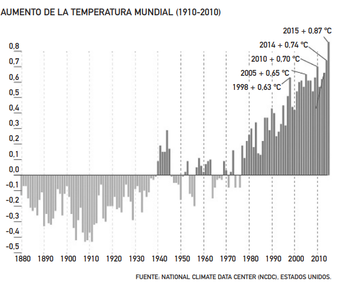
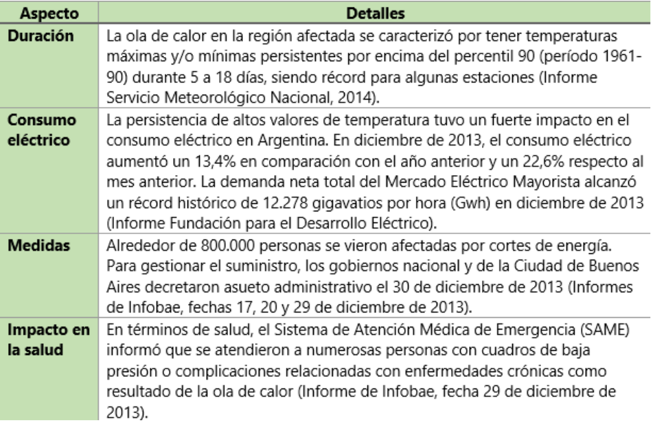
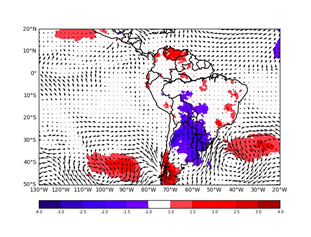
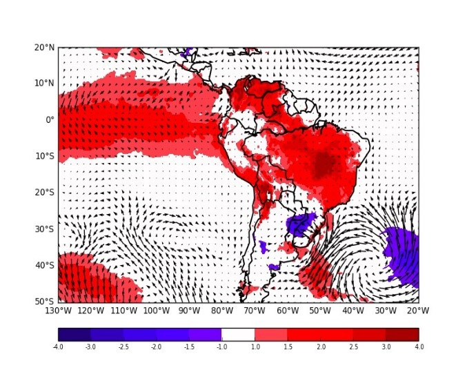
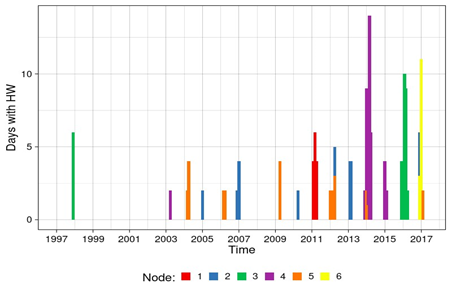
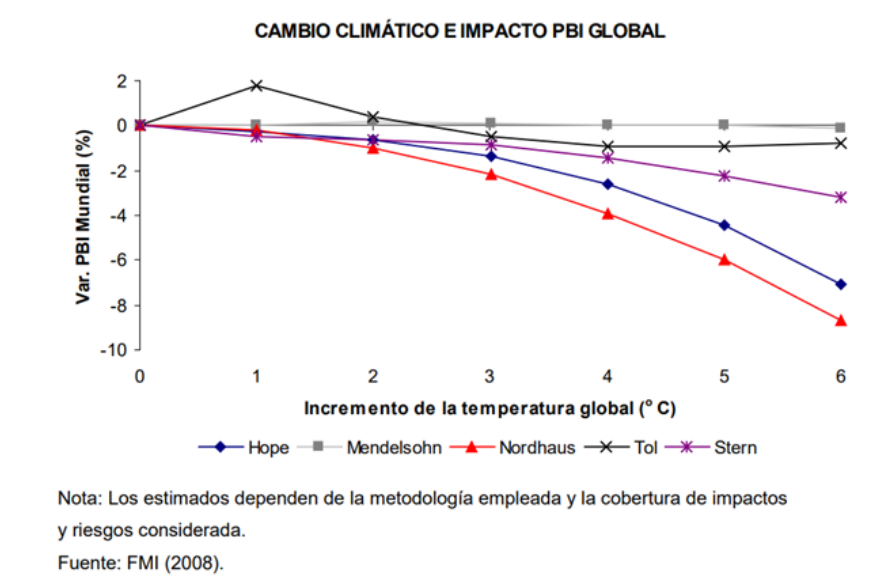
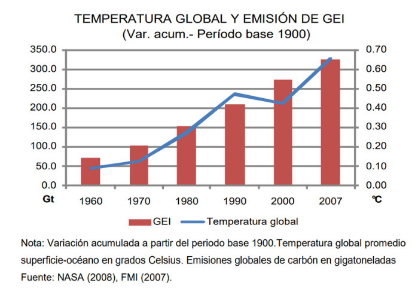

<h1>Entregable 3</h1>

<h2>Contexto Social</h2>
<h3>A Nivel Mundial</h3>

En nuestro mundo globalizado muchos sectores tienen nexos con el cambio del clima. Este hecho afecta a la población, principalmente a los niños y ancianos. Además de afectar a los ecosistemas a nivel mundial y en el sector económico, donde los impactos se producen desde niveles locales como los fenómenos urbanos (isla de calor*, contaminación y advocaciones de biomasa) o a escala global como las migraciones climáticas, 18 desigualdad y pobreza (Aldaz,2017).

Los cambios drásticos en el clima debidos principalmente a la influencia humana comenzaron en 1950, lo que ha supuesto que desde 1880 hasta 2012 la temperatura media global haya aumentado 0,85 ºC (entre 0,65 ºC y 1,06 ºC) (IPCC, 2013). Para trasmitir lo que implica una variación así en la temperatura, podemos centrarnos en el año 2015, que ha sido hasta la fecha el año más cálido jamás registrado: 0,76 ºC por encima del promedio de 1961 a 1990 y 1 ºC por encima de los valores preindustriales.
 Aquel año, distintas olas de calor afectaron a numerosas regiones del mundo y muchos récords de calor se vieron destronados, según datos de la Organización Meteorológica Mundial (OMM) (Diaz,2005). Estas elevadas temperaturas contribuyeron a una importante pérdida de vidas por ola de calor: 1,2 millones de personas se vieron afectadas por las temperaturas extremas, con un total de 7.346 muertes registradas por calor. De ellas, 3.275 ocurrieron en Francia, 2.248 en India y 1.299 en Pakistán (Kendrovski,2017).

 

Y la temperatura sigue aumentando. En cuanto a las proyecciones futuras de cambio climático, el IPCC estima para finales del siglo XXI un incremento de la temperatura superficial media de 1 a 3,7°C, dependiendo de los distintos escenarios de emisión.

<h3>A Nivel Regional</h3>

En la segunda mitad de diciembre de 2013, se experimentó un lapso caracterizado por temperaturas elevadas en la región centro-norte de Argentina. El Servicio Meteorológico Nacional (SMN) identificó esta condición como un episodio de ola de calor (Informe Servicio Meteorológico Nacional, 2014). 

<h4>Argentina</h4>

FUENTE: ELABORACION PROPIA

 
<h4>Uruguay</h4>

Este fenómeno térmico extremo también impactó a Uruguay, generando un notable aumento en el consumo de electricidad. Se estableció un nuevo récord de consumo de energía en verano, alcanzando los 1837 MW, según el reporte de la Administración del Mercado Eléctrico de dicho país. Además, propició la ocurrencia de un incendio forestal en el departamento de Rocha, afectando alrededor de 50 hectáreas de bosque, según el informe del Sistema Nacional de Emergencias (Diario La República, 29 de diciembre de 2013). Estos eventos resaltan el impacto excepcional que la ola de calor tuvo en la población de la región afectada.
Este impacto no solo se atribuye a las elevadas temperaturas, sino también a su persistencia, indicando que la escala intraestacional desempeñó un papel crucial. Esta observación coincide con las conclusiones de Cerne y Vera (2011) sobre la dinámica asociada con las olas de calor estivales en la región central de Argentina. Según estas autoras, la variabilidad intraestacional ejerce una influencia significativa en la ocurrencia de olas de calor estivales prolongadas, y esta influencia está mayormente relacionada con la actividad de la Zona de Convergencia del Atlántico Sur (SACZ).

<h3>A Nivel Nacional</h3>

El Perú exhibe una marcada susceptibilidad frente a cambios climáticos significativos, como se evidencia en las pérdidas económicas asociadas a fenómenos como El Niño. Bajo un escenario pasivo, los impactos del cambio climático podrían intensificarse, ya que se verían potenciados por la interacción con otros mecanismos adversos que afectan negativamente el desarrollo. Estos incluyen la disminución de la disponibilidad de recursos hídricos (tanto para consumo humano como para generación energética) debido al retroceso glaciar, la reducción de la productividad en sectores agrícolas y pesqueros derivada del aumento de la temperatura del mar, la merma en la biodiversidad, y repercusiones en la salud humana (Atwoli,2021).

Vista sinóptica de la anomalía máxima de la temperatura del aire durante las OC. Unidad en grados Celsius. (Extraído de repositorio SENHAMI) 

 

En la provincia de Lima se han realizado estudios que identifican las ICU enfocándose en el área espacial que abarcaría este fenómeno (Menacho,2019; Soberón, 2014) y, asimismo, en formular medidas para aminorar su impacto (IDOM, 2021). Sin embargo, existen limitaciones en cuanto a las razones especificas por las que se originan y no se ha logrado contabilizar cuales son las implicancias que han tenido en nuestra sociedad (Laura,2023). 
Una de las regiones más afectada por este fenómeno, es Piura, que registra días mas calurosos en los últimos años. Personas han muerto debido a las olas de calor, especialmente niños de menos de dos años de edad. (El Comercio, 2016).

Nodo asignado a las olas de calor en la costa norte del Perú (Extraído de repositorio SENHAMI)

 
 
<h2>Contexto Económico</h2>
<h3>A Nivel Mundial</h3>

El cambio climático y el aumento de temperatura es una problemática que afecta a nivel mundial. Por ello, se debe adoptar una política ambiental rígida frente a este tema para no avanzar a escenarios extremos de más de 5° C en la temperatura mundial para fin de siglo ya que significaría pérdidas de hasta 20% del PBI mundial. Asimismo, entre las regiones más afectadas se encuentran las que tienen sistemas productivos más sensibles al clima como África, el Sur y Sur-Este de Asia y América Latina (Vargas, 2009).

Además, es necesario tomar más acciones de mitigación ya que esto reducirá la necesidad de que los países se adapten a los efectos del cambio climático caso contrario los costos de adaptación serán significativos. Según el quinto informe del IPCC, los costos anuales serán de 100 mil millones de dólares desde 2050. Sin embargo, el Adaptation Gap Report publicado por el PNUD en 2014, comenta que estos costos se pueden triplicar en caso no se tomen las medidas urgentes necesarias. Según el informe de la Comisión Global de Economía y Clima, los próximos 15 años serán críticos para la economía mundial, dado que crecerá más del 50%. Aproximadamente mil millones de personas se trasladarán a las ciudades y se invertirán cerca de 90 billones de dólares en infraestructura, uso de la tierra y sistemas de energía (Rodríguez y Mance, 2009).

Según la NASA, la temperatura promedio global superficie-océano aumentó en promedio 0,01°C al año en el período 1900- 2007. Asimismo, en el 2007 la temperatura global promedio habría aumentado en 0.66°C respecto al año 1900 (Vargas, 2009).

Según la NASA, la temperatura promedio global superficie-océano aumentó en promedio 0,01°C al año en el período 1900- 2007. Asimismo, en el 2007 la temperatura global promedio habría aumentado en 0.66°C respecto al año 1900 (Vargas, 2009).

 

Estos estudios exponen que el impacto del cambio climático sobre el PBI global es relevante y no lineal, puesto que está en función al incremento de la temperatura. Los aumentos moderados de la temperatura (2° C) generarían una gran reducción del PBI mundial del orden de 1% al año 2100. Por otro lado, los incrementos por encima de 5° C significarían una disminución de hasta el 9% a dicha fecha (Vargas, 2009).

Asimismo, la Comunidad Andina de Naciones, sostiene que al respecto a los efectos del cambio climático en países de la subregión, «al año 2025, el daño económico en los países de la Comunidad Andina significaría una pérdida aproximada de 30.000 millones de dólares anuales equivalentes al 4,5% del PBI, pudiendo comprometer el potencial de desarrollo de todos los países de la región» (2008, p. 22). Dichas cifras son alarmantes y a partir de este momento merecen una gran importancia.

Por otro lado, el aumento de la concentración de GEI ha acelerado el calentamiento global. La temperatura promedio a nivel mundial se ha elevado en 0.65°C  respecto a la temperatura de la primera mitad del siglo pasado (1900-1949) (Vargas, 2009).

 

<h3>A Nivel Regional</h3>

Entre las regiones más afectadas por el cambio climático y el aumento de temperatura son África, el Sur y Sur-Este de Asia y América Latina. Por otro lado, países como China y USA manifiestan menores impactos por el cambio climático y tienen la mayor contribución en la acumulación de GEI (Vargas, 2009).

Un claro ejemplo del efecto económico que causa el cambio climático y el aumento de temperatura es Colombia. Según, el Estudio de impactos Económicos del Cambio Climático en Colombia menciona que, de no adaptarse al cambio climático, sus efectos sobre la economía de la nación serán altamente significativos (DNP-BID, 2014). Los sectores de (agricultura, ganadería, pesca, forestal y transporte) y otros tienen un aporte a la economía del país. Es por ello, que necesitan proveer de servicios ecosistémicos, recurso hídrico y especies nativas que representan 4,3% del PIB actual. Asimismo, entre el 2010-2100 se pueden generar pérdidas económicas equivalentes a 3,7 veces del PIB actual (DNP-BID, 2014). 

Estas pérdidas son equivalentes a como si el país sufriera cada 4 años perdidas económicas como las que ocurrieron durante La Niña en 2010-2011. Este fenómeno podría presentarse durante el tiempo, todos estos resultados son ocasionados dado que los sectores no tomas medidas y acciones necesarias para mitigar su vulnerabilidad, en otras palabras, no se están adaptando al cambio climático (Rodríguez y Mance, 2009).  

 
<h3>A Nivel Nacional</h3>

El Tyndall Center de Inglaterra, for Climate Change Research menciona que, el Perú se encuentra entre los 10 países mas vulnerables ante eventos de cambio climático al igual que Honduras, Bangladesh y Venezuela. Esto es asociado a la dependencia hacia algunos sectores, así como el bajo nivel institucional que ponen en riesgo la planificación y ejecución de medidas de adaptación concretas (Tyndall Center, 2003).

Según el marco teórico propuesto por Dell, et al (2008) se estima que en el Perú habrá una pérdida del 6 por ciento respecto al PBI potencial en el año 2030, generado por el aumento de 2°C en la temperatura máxima y el 20 por ciento en la variabilidad de las precipitaciones al 2050. Por otro lado, estas pérdidas podrían reducirse a la tercera parte si se adoptan políticas globales que normalicen las variables climáticas al 2030.

En nuestro país existió una gran pérdida económica por el fenómeno del Niño 98, la inversión realizada durante la etapa de emergencia y rehabilitación del Niño 98 por la descolmatación de canales y drenes, encauzamiento y dique de ríos, Impacto en Infraestructura 36 etc., supero los $ 168 millones. En cambio, el costo total de rehabilitación y reconstrucción de la infraestructura del país (carreteras, caminos, puentes) ascendió a US$ 685 millones (Conam 2001).

 
 
<h2>REFERENCIAS BIBLIOGRÁFICAS</h2>
<ul>
<li>Aldaz, J. y Díaz, J. (2017): “Situación del Convenio Marco de Naciones Unidas sobre el Cambio Climático. Resumen de las Cumbres del Clima de París, COP21 y de Marrakech, COP 22”, Revista de Salud Ambiental, 17 (1), pp. 34-39</li>
<li>Díaz, J.; Linares, C. y García, R. (2005): “Impacto de las temperaturas extremas en la salud pública: futuras actuaciones”, Revista Española de Salud Pública, 79, pp. 145-157</li>
<li>Kahn, B. (2017): “This Is How Climate Change Will Shift the World’s Cities”, disponible en: http://www.112 climatecentral.org/news/globalcities-climate-change-21584</li>
<li>Alvarez MS, Vera C, Kiladis GN y Liebmann B, 2015: Influence of the Madden Julian Oscillation on precipitation and surface air temperature in South America. Climate Dynamics.</li>
<li>Cerne B y Vera C, 2011: Influence of the intraseasonal variability on the development of heat waves in subtropical South America . Climate Dynamics. 36:2265–2277 - DOI: 10.1007/s00382-010-0812-4.</li>
<li>Cerne B, Vera C y Liebmann B, 2007: The nature of a heat wave in eastern Argentina occurring during SALLJEX. Monthly Weather Review , vol 135, 1165-74.</li>
<li>González P. y Vera C. 2014: Summer precipitation variability over South America on long and short intraseasonal timescale. Climate Dynamics. On line first . DOI 10.1007/s00382-013-2012-3.</li>
<li>INFOBAE 17, 20 y 29 diciembre 2013 : http://www.infobae.com/2013/12/17/1531496-la-ola-calor-disparo-otro-record-el-consumo-energia</li>
<li>Atwoli, L., Baqui, A. H., Benfield, T., Bosurgi, R., Godlee, F., Hancocks, S., ... & Vázquez, D. (2021). Llamamiento a adoptar medidas urgentes para limitar los aumentos de temperatura en el mundo, restablecer la diversidad biológica y proteger la salud. Cadernos de Saúde Pública, 37.</li>
<li>Laura, W. (2023). Olas de calor y su influencia en la salud humana en Piura y Lima. https://repositorio.senamhi.gob.pe/handle/20.500.12542/3062</li>
</ul>

 
 

<a href="README.md">Enlace al README de Entregables</a>