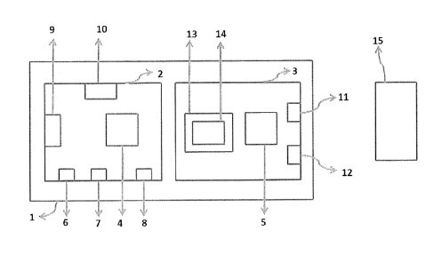
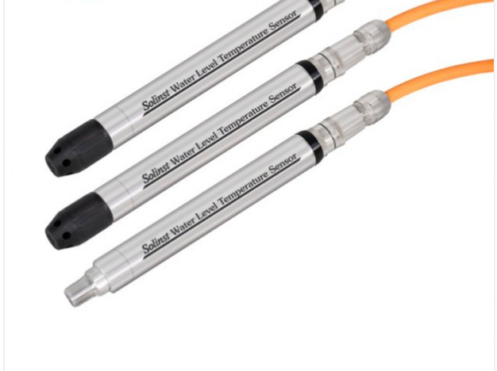
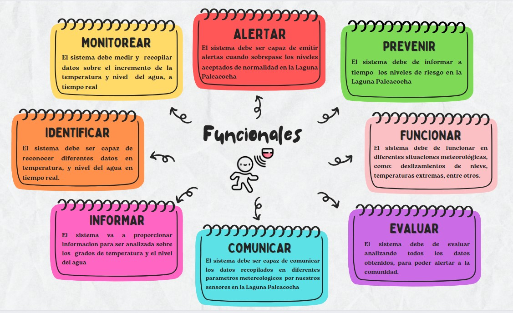
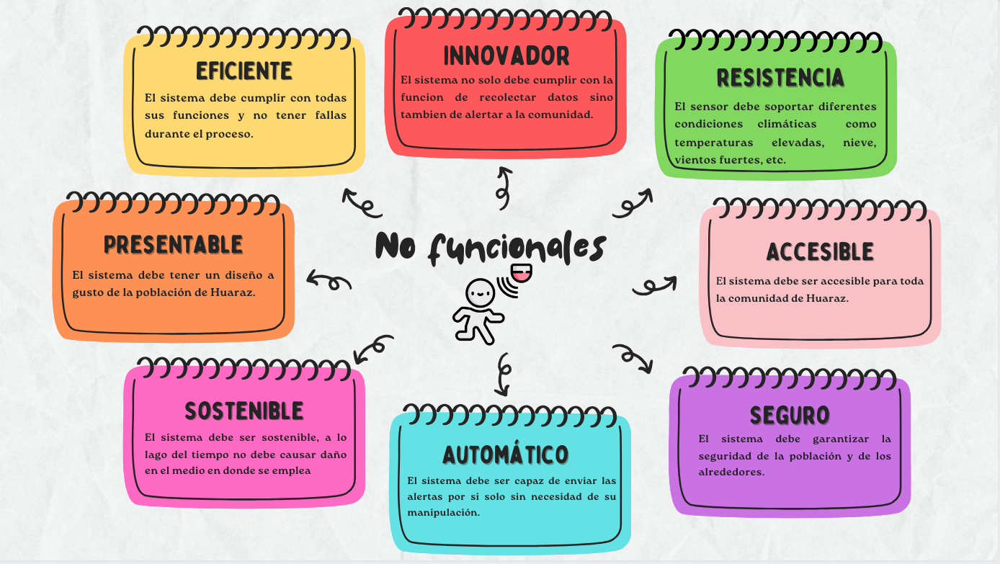

<h1>ESTADO DEL ARTE</h1>
<h2>1.CONTEXTO CIENTIFICO</h2>
<h4><b>Articulo 1</b></h4>
<h3 align="center"><b>"A global assessment of the societal impacts of glacier outburst floods"</b></h3>

Este artículo es una investigación que muestra cuáles son los impactos  que tienen las inundaciones por desbordamiento de glaciares en la sociedad, donde cualitativamente se comparan datos de 20 países, concluyendo que de 1348 inundaciones de glaciares, el 24% tuvo un impacto social (muertes, pérdida de infraestructura, pérdidas económicas perturbación de las comunidades aledañas). Por lo que existe una relación directa con factores ambientales como el incremento de la temperatura y la actividad volcánica que puede existir en estas zonas y la falta de una cultura de prevención para evitar estos desastres.

América del Sur es una de las regiones más vulnerables en el planeta, donde al menos hubieron 5745 muertes,  es preciso aclarar que el 88% de las muertes son atribuibles al evento sucedido en huaraz (1941).Por otro lado este estudio también muestra las pérdidas intangibles, que sufre la sociedad luego de pasar por un fenómeno de este tipo. Destacando que la salud mental es la más afectada, puesto que las pérdidas primarias y secundarias de bienes son muy fuertes.

<h4><b>Articulo 2</b></h4>
<h3><b>"Modeling a glacial lake outburst flood process chain: The case of Lake Palcacocha and Huaraz, Peru"</b></h3>

El estudio aborda la simulación detallada de un evento de desbordamiento glaciar del Lago Palcacocha hacia la ciudad de Huaraz, destacando avances en la representación física mediante modelos tridimensionales hidrodinámicos. Se exploran escenarios de mitigación, revelando que reducir el nivel del lago disminuye significativamente el área afectada. Para el evento de avalancha más grande, se estima un tiempo de viaje de 1 hora y 20 minutos a la ciudad, con el pico de la inundación 2-3 minutos después. La intensidad de la inundación se presenta en un mapa, enfocándose en áreas críticas cerca del río Quillcay. Se compara la simulación con el evento de 1941, aunque se destaca la necesidad de cautela en la interpretación. Además, se discuten eventos históricos, como el colapso de la morrena lateral en 2003, resaltando la importancia de abordar las olas generadas por avalanchas. La calibración del modelo se reconoce como un desafío, evidenciando limitaciones y destacando la necesidad de validar completamente el modelo. Estos hallazgos respaldan la importancia de sistemas de alerta temprana y exploran estrategias de mitigación considerando la complejidad de eventos de desbordamiento glaciar.

<h4><b>Articulo 3</b></h4>
<h3><b>"70 years of lake evolution and glacial lake outburst floods in the Cordillera Blanca (Peru) and implications for the future"</b></h3>

En el artículo, se estudia  el desarrollo de los lagos glaciares en la Cordillera Blanca y cómo se relacionan con el cambio climático y el retroceso glaciar. Se utilizan datos históricos y modelos climáticos para prever un aumento en la superficie de los lagos y la formación de nuevos. El área total de los lagos en la Cordillera, aumentaron durante el período 1948-2017, impulsado principalmente por el retroceso de los glaciares.  En 1948 había 517 lagos desprendidos de glaciares (es decir, el 85,2% de todos los lagos en 1948), este número aumentó a 798 en 2017 (91,7% del total en 2017).  La frecuencia máxima ocurrió en las décadas de 1930-1950, con un cambio hacia GLOF en lagos con represas de lecho de roca en comparación con morrenas

Cabe resaltar que en 1948, el 71% de la superficie total favorable para el desarrollo de los lagos en la región estaba ocupada por lagos, y en 2018 aumentó hasta el 90%. Por lo tanto, sigue siendo posible una nueva expansión de la superficie total de los lagos de alrededor del 10% hasta finales del siglo XXI. , a medida que los glaciares en retroceso descubren depresiones en la topografía del lecho del glaciar, lo que permite que los lagos existentes se expandan y surjan nuevos lagos.

<h1>2.CONTEXTO COMERCIAL</h1>
<h2>2.1 PATENTES</h2>
<h3>2.1.1. (US9835501) Sensor y sistema inalámbrico de temperatura y humedad, y método de medición. (invención)</h3>

La invención describe un sensor inalámbrico de temperatura y humedad que utiliza resonadores de ondas acústicas de superficie alimentados por una red de alimentación a través de una antena. Este sensor tiene un resonador de referencia y resonadores de medición, y la diferencia de frecuencia resonante entre ellos se emplea para modular la medición de temperatura y/o humedad. El sistema resultante puede controlar tanto la temperatura como la humedad simultáneamente, o seleccionar el control de una de ellas de manera individual. Además, la modulación diferencial ayuda a mitigar la deriva de frecuencia causada por el envejecimiento del material del sensor y el conector, mejorando así la estabilidad a largo plazo de la medición y eliminando la necesidad de recalibración.  Abordando un sensor inalámbrico específicamente diseñado para medir temperatura y humedad, empleando resonadores de ondas acústicas de superficie. Un sensor de onda acústica de superficie (SAW) es un dispositivo en el cual la SAW sirve como un portador de información sensible al entorno. Este tipo de sensor destaca por su alta precisión, respuesta rápida y tamaño compacto, entre otras propiedades. (Zheng, Q., & Li, Z. , 2017)

<b>FIGURA 1</b>

<h3>2.1.2. (KR101849730) Mediciones meteorológicas locales basadas en el sistema y método de monitoreo de inundaciones fluviales. (invención)</h3>

La presente invención se trata de un sistema para monitorear inundaciones en ríos basado en mediciones meteorológicas locales. El sistema predice la probabilidad de inundación en un río con estacionamiento cercano, proporcionando esta información al usuario del estacionamiento y a un centro de control de televisión por cable integrado (CCTV). Incluye un módulo de medición del nivel del agua del río, un módulo de monitoreo de inundaciones, un módulo de gestión de estacionamiento con reconocimiento de matrículas y un indicador de señal para indicar la imposibilidad de entrada según la probabilidad de inundación. Además, cuenta con un módulo de alarma para transmitir la señal de riesgo de inundación a usuarios, centros de desastres y organizaciones relacionadas.(한택진 ,2018)

<b>FIGURA 2:</b> Modulo de monitoreo de inundaciones cerca de un rio

<h3>2.1.3. (PE 2021-2206)  DISPOSITIVO ELECTRÓNICO PORTÁTIL PARA MONITOREAR VARIABLES MEDIOAMBIENTALES (utilidad)</h3>

El sistema propuesto consta de dos partes: el sistema de adquisición de datos, que incluye sensores de temperatura ambiental, humedad/temperatura del suelo, pH del agua de riego, y un reloj en tiempo real; y el sistema de transmisión y almacenamiento de datos. Cada sistema tiene un microcontrolador. El primero permite la configuración de parámetros a través de una entrada de comunicación serial/USB. El segundo posibilita a los usuarios acceder a la información de los sensores mediante módulos de comunicación inalámbrica desde dispositivos móviles o portátiles. También cuenta con un módulo de almacenamiento de datos. Un dispositivo móvil o portátil contiene una aplicación que visualiza y monitorea los datos del sensor, además de identificar enfermedades en las plantas a través de imágenes capturadas por su cámara.(Huaman et al. ,2021)

<b>FIGURA 4:</b> Modulo de monitoreo de inundaciones cerca de un rio

<h3>2.1.4. (MX2018010814) SISTEMA DE CONTROL DE INUNDACIONES. (utilidad)</h3>

Un sistema de control de inundaciones que está configurado para desplegarse para controlar las aguas de inundación en el que el sistema de control de inundaciones se proporciona en configuraciones de múltiples compartimientos de receptáculos modulares. El sistema de control de inundaciones incluye una pluralidad de receptáculos modulares que tienen cuatro paredes en las que las cuatro paredes están acopladas de forma móvil para hacer una transición intermedia entre una posición plegada y una posición desplegada. Las paredes del sistema de control de inundaciones incluyen una pluralidad de aberturas y estructuras de esquina que tienen forma helicoide de bobina. Se proporciona un pasador de bloqueo para ser acoplado operativamente a los receptáculos modulares intermedios para proporcionar una conexión mecánica entre ellos. Un revestimiento está dispuesto dentro del volumen interior de los receptáculos modulares y tiene una forma acoplable con el mismo. El revestimiento incluye una realización abierta o cerrada y está configurado para recibir ruido en el mismo.(Burkett , 2021)

<h2>2.2 EQUIPOS Y DISPOSITIVOS EXISTENTES EN EL MERCADO</h2>
<h3>2.2.1Medidor de nivel de agua
</h3>

Objetivo: 
Medir la profundidad del agua en tuberías, pozos y perforaciones.

Descripción:
Contiene una sonda de acero inoxidable equipada con una cinta graduada flexible, enrollada en un carrete manual, acompañada de indicadores auditivos y visuales. Es especialmente útil para la medición precisa de la profundidad del agua en tuberías, pozos y perforaciones. El diseño de la cinta impide que esta se adhiera a superficies húmedas, como el revestimiento de un pozo, asegurando así mediciones exactas(Geoteknik, 2019).

<b>FIGURA 3:</b> imagen del medidor de nivel de agua

<h3>2.2.2 Sensor De Temperatura Del Nivel Del Agua
</h3>

Objetivo: 
Medir la temperatura y nivel del agua

Descripción:
El transmisor de nivel hidrostático sumergible de Solinst, destinado a medir la temperatura y el nivel de agua, es un dispositivo compacto todo en uno que ofrece lecturas estables y precisas de manera continua. Este sensor es versátil y adecuado para diversas aplicaciones.
Características:
<ul>
<li>Sensor de presión, ya sea absoluto o ventilado, diseñado para mediciones de nivel de agua altamente precisas con una exactitud del 0,05 % FS. </li>
<li>La sonda única es programable para operar con los protocolos MODBUS o SDI-12. Incorpora filtros hidrófobos sin necesidad de desecantes (en la versión ventilada).</li>
<li>La carcasa, compacta y de diámetro estrecho, facilita instalaciones discretas, mientras que su diseño robusto, con sellos de doble junta tórica, garantiza una protección avanzada contra fugas.</li>
<li>Con cables resistentes, permite un despliegue confiable de hasta 300 m y presenta una rosca NPTM de 1/4" para conexión a tuberías y conductos(Com.pe, s. f).</li>

</ul>

<b>FIGURA 4:</b> Imagen del sensor de temperatura de nivel de agua

<h3>2.2.3 Medidor de nivel de agua por radar
</h3>

Objetivo: 
Medir el nivel de agua en tanques industriales

Descripción:
Sensor fabricado con material de PTFE, diseñado para su aplicación en diversas situaciones, ya sea en tanques de almacenamiento básicos, en entornos corrosivos o agresivos, o en aplicaciones que requieran mediciones de tanques con alta precisión (Supmea Automation, s. f.).

<b>FIGURA 5:</b> Modelo del medidor por radar

<h3>2.2.4 Medidor de nivel de agua "HOBO" con datalogger
</h3>

Objetivo: 
Medir los cambios de nivel de agua en acuíferos.

Descripción:
Este dispositivo se emplea para supervisar cambios en los niveles de agua en diversas zonas, como arroyos, lagos, zonas de marea y aguas subterráneas, abarcando un amplio rango de entornos. Estos medidores suelen colocarse en áreas de aguas tranquilas o en pozos especialmente diseñados para alojar instrumentos de medición de nivel de agua.
Cuenta con suficiente capacidad de memoria para almacenar hasta 21,700 mediciones combinadas de ambos parámetros(Agromatic, s. f.).

<b>FIGURA 6:</b> Medidor de nivel de agua "HOBO" con datalogger

<h2>¿QUÉ NOS DIFERENCIA?</h2>

A diferencia de otros dispositivos que se encuentran en el mercado, nuestro sensor no solo va a medir los niveles de agua de la laguna Palcacocha sino también tendrá un sistema de alerta para la comunidad de Huaraz. Asimismo, nuestro sensor tiene como objetivo ayudar a la población de Huaraz dando fácil acceso a los datos de nivel de agua de la laguna que no son proporcionados por ningún otro sensor. Por ello, se evitará las consecuencias significativas ocasionadas por inundaciones protegiendo así a la población de Huaraz en los próximos años

<h2>3. LISTA DE REQUERIMIENTOS FUNCIONALES</h2>

<h2>4. LISTA DE REQUERIMIENTOS NO FUNCIONALES</h2>

<h2>5. Bibliografia</h2>
<ul>
<li>Zheng, Q., & Li, Z. (2017). Wireless temperature and humidity sensor and system, and measurement method (Patent Núm. 9835501). En US Patent (Núm. 9835501).</li>
<li>Huaman et.al.(2021). DISPOSITIVO ELECTRÓNICO PORTÁTIL PARA MONITOREAR VARIABLES MEDIOAMBIENTALES (Patent Núm.344435440). En PE Patent (Núm.344435440).</li>
<li>한택진 (2018). Local meteorological measurements based on river flood monitoring system and method (Patente No. KR101849730B1). Oficina de Patentes de Corea del Sur.</li>
<li>Brukett , Glenn (2021). SISTEMA DE CONTROL DE INUNDACIONES (Patente No. MX2018010814). Oficina de patentes de Mexico(No. 2018010814 )</li>
<li>Jonathan L. Carrivick, Fiona S. Tweed,A global assessment of the societal impacts of glacier outburst floods,Global and Planetary Change,Volume 144,2016,Pages 1-16.</li>
<li>Somos-Valenzuela, M.A., Chisolm, R.E., Rivas, D.S., Portocarrero, C., McKinney, D.C. Modeling a glacial lake outburst flood process chain: The case of Lake Palcacocha and Huaraz, Peru (2016) Hydrology and Earth System Sciences, 20 (6), pp. 2519-2543. Cited 48 times.</li>
<li>Adam Emmer, Stephan Harrison, Martin Mergili, Simon Allen, Holger Frey, Christian Huggel,
70 years of lake evolution and glacial lake outburst floods in the Cordillera Blanca (Peru) and implications for the future,Geomorphology,Volume 365,2020,107178,ISSN 0169-555X
</li>
<li>Medidor de Nivel de Agua. (2019, enero 25). Geoteknik; Geoteknik S.A.C.</li>
<li>Medidor de nivel por radar SUP-RD902T 26 GHz. (s/f). Supmea Automation Co.,Ltd.</li>
<li>Sensor de temperatura del nivel del agua 301. (s/f). Com.pe.</li>
<li>Somos la mejor empresa en la comercialización de herramientas metereologicas. (s/f). agromatic.com.pe.</li>
</ul>

 
 
 

<a href="README.md">Enlace al README de Entregables</a>

