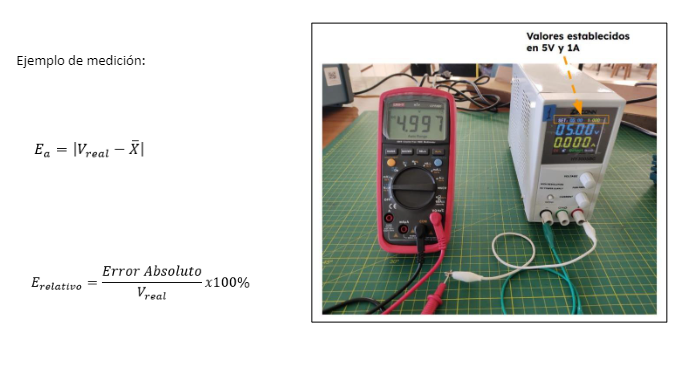
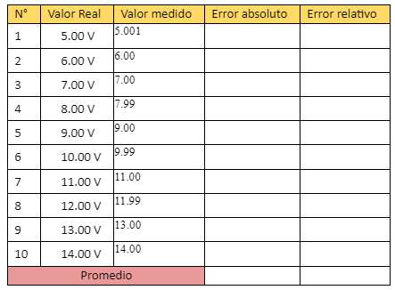
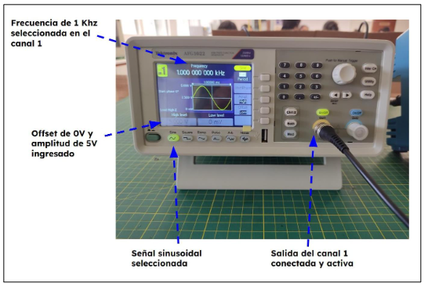

<h1>Informe 1</h1>
<h2>MATERIALES Y EQUIPOS</h2>

<table border="1">
 <tr>
<th>Modelo</th>
<th>Materiales</th>
<th>Cantidad</th>

</tr>
<tr>
<td>HY3005BC</td>
<td>Fuente de alimentación regulable</td>
<td>1</td>
</tr>
<tr>
<td>UT139C</td>
<td>Multímetro Digital</td>
<td>1</td>

</tr>
<tr>
<td>AFG1022</td>
<td>Generador de Señales</td>
<td>1</td>

</tr>
<tr>
<td>TBS 1000C Series</td>
<td>Osciloscopio Digital</td>
<td>1</td>

</tr>
<tr>
<td></td>
<td>Cable BNC Male-Male</td>
<td>1</td>

</tr>
<tr>
<td></td>
<td>Punta de osciloscopio con conector BNC (Male)</td>
<td>1</td>

</tr>
<tr>
<td></td>
<td>Par de cables cocodrilos</td>
<td>1</td>

</tr>
</table>

<h2>PROCEDIMIENTOS</h2>

Identifique y organice su grupo de trabajo. Verifique el estado de los equipos de protección personal (EPP).

<h3>2.1 Uso del multímetro y Fuente de alimentación</h3>
<ul>
    <li>Encender la Fuente de alimentación y configurarla a 5V y 1A</li>
    <li>Colocar los cables cocodrilos en las borneras + y -</li>
    <li>Configurar el Multímetro en el parámetro de Voltaje</li>
    <li>Presionando el botón Output habilitar la tensión de salida de la fuente</li>
    <li>Usando las puntas de prueba del multímetro, realizar 10 mediciones y anotarlas.</li>
    <li>Asumiendo que lo mostrado en el Display de la fuente de la alimentación es el Valor Real, calcular el error absoluto y error relativo del multímetro.</li>
</ul>

<h3>2.2 Uso del Generador de Señales y Osciloscopio</h3>
<ul>
    <li>Encender el Generador de Señales y el Osciloscopio</li>
    <li>Configurar el Generador de Señales para proporcionar una señal sinusoidal de 1 KHz de frecuencia, 5V de Amplitud y 0V de offset, por el canal 1.</li>
    <li>Conectar un extremo del cable BNC en el canal 1 del generador de señales y el otro extremo en el canal 1 del osciloscopio.</li>
    <li>Mediante los controles de Posición Vertical, Horizontal y Disparo ajustar la visualización de la señal sinusoidal</li>
    <li>Haciendo uso de los cursores, calcular y mostrar en el osciloscopio las medidas de Amplitud y Periodo de la señal.</li>   
</ul>
