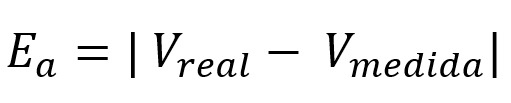
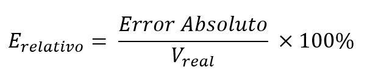

<h1>Informe 1</h1>
<h2>1. MATERIALES Y EQUIPOS</h2>

<table border="1">
 <tr>
<th>Modelo</th>
<th>Materiales</th>
<th>Cantidad</th>

</tr>
<tr>
<td>HY3005BC</td>
<td>Fuente de alimentación regulable</td>
<td>1</td>
</tr>
<tr>
<td>UT139C</td>
<td>Multímetro Digital</td>
<td>1</td>

</tr>
<tr>
<td>AFG1022</td>
<td>Generador de Señales</td>
<td>1</td>

</tr>
<tr>
<td>TBS 1000C Series</td>
<td>Osciloscopio Digital</td>
<td>1</td>

</tr>
<tr>
<td></td>
<td>Cable BNC Male-Male</td>
<td>1</td>

</tr>
<tr>
<td></td>
<td>Punta de osciloscopio con conector BNC (Male)</td>
<td>1</td>

</tr>
<tr>
<td></td>
<td>Par de cables cocodrilos</td>
<td>1</td>

</tr>
</table>

<h2>2. PROCEDIMIENTOS</h2>

Identifique y organice su grupo de trabajo. Verifique el estado de los equipos de protección personal (EPP).

<h3>2.1 Uso del multímetro y Fuente de alimentación</h3>
<ul>
    <li>Encender la Fuente de alimentación y configurarla a 5V y 1A</li>
    <li>Colocar los cables cocodrilos en las borneras + y -</li>
    <li>Configurar el Multímetro en el parámetro de Voltaje</li>
    <li>Presionando el botón Output habilitar la tensión de salida de la fuente</li>
    <li>Usando las puntas de prueba del multímetro, realizar 10 mediciones y anotarlas.</li>
    <li>Asumiendo que lo mostrado en el Display de la fuente de la alimentación es el Valor Real, calcular el error absoluto y error relativo del multímetro.</li>
</ul>

<table border="1">
<tr>
<th>N°</th>
<th>Valor Real</th>
<th>Valor Medido</th>
<th>Error Absoluto</th>
<th>Error Relativo</th>
</tr>
<tr>
<td>1</td>
<td>5.00 V</td>
<td>5.001</td>
<td>0.001</td>
<td>0.0002</td>
</tr>
<tr>
<td>2</td>
<td>6.00 V</td>
<td>6.00</td>
<td>0</td>
<td>0.0</td>
</tr>
<tr>
<td>3</td>
<td>7.00 V</td>
<td>7.00</td>
<td>0</td>
<td>0.0</td>
</tr>
<tr>
<td>4</td>
<td>8.00 V</td>
<td>7.99</td>
<td>0.01</td>
<td>0.00125</td>
</tr>
<tr>
<td>5</td>
<td>9.00 V</td>
<td>9.00</td>
<td>0</td>
<td>0.0</td>
</tr>
<tr>
<td>6</td>
<td>10.00 V</td>
<td>9.99</td>
<td>0.01</td>
<td>0.001</td>
</tr>
<tr>
<td>7</td>
<td>11.00 V</td>
<td>11.00</td>
<td>0</td>
<td>0.0</td>
</tr>
<tr>
<td>8</td>
<td>12.00 V</td>
<td>11.99</td>
<td>0.01</td>
<td>0.00083</td>
</tr>
<tr>
<td>9</td>
<td>13.00 V</td>
<td>13.00</td>
<td>0</td>
<td>0.0</td>
</tr>
<tr>
<td>10</td>
<td>14.00 V</td>
<td>14.00</td>
<td>0</td>
<td>0.0</td>
</tr>
<tr>
<td>Promedio</td>
<td></td>
<td></td>
<td>0.0031</td>
<td>0.0003283</td>
</tr>
</table>

<h3>2.2 Uso del Generador de Señales y Osciloscopio</h3>
<ul>
    <li>Encender el Generador de Señales y el Osciloscopio</li>
    <li>Configurar el Generador de Señales para proporcionar una señal sinusoidal de 1 KHz de frecuencia, 5V de Amplitud y 0V de offset, por el canal 1.</li>
    <li>Conectar un extremo del cable BNC en el canal 1 del generador de señales y el otro extremo en el canal 1 del osciloscopio.</li>
    <li>Mediante los controles de Posición Vertical, Horizontal y Disparo ajustar la visualización de la señal sinusoidal</li>
    <li>Haciendo uso de los cursores, calcular y mostrar en el osciloscopio las medidas de Amplitud y Periodo de la señal.</li>   
</ul>
<h4>Ejemplo de Prueba<h4>

<h2>3. Entregables</h2>
<h3>Promedio de errores absoluto y relativo.</h3>

<ul>
    <li>5.00 V - 5.001 = 0.001</li>
    <li>6.00 V - 6.000 = 0</li>
    <li>7.00 V - 7.00 = 0</li>
    <li>8.00 V - 7.99 = 0.125</li>
    <li>9.00 V - 9.00 = 0</li>
    <li>10.00 V - 9.99 = 0.1</li>
    <li>11.00 V - 11.00 = 0</li>
    <li>12.00 V - 11.99 = 0.076</li>
    <li>13.00 V - 13.00 = 0</li>
    <li>14.00 V - 14.00 = 0</li>
</ul>
<h4>PROMEDIO = 0.031</h4>

<ul>
    <li>N°1 = (0.001)/5.00 x 100% = 0.0002</li>
    <li>N°2 = (0.00)6.00 x 100% = 0.0</li>
    <li>N°3 = (0.00)7.00 x 100% = 0.0</li>
    <li>N°4 = (0.01)8.00 x 100% = 0.00125</li>
    <li>N°5 = (0.00)9.00 x 100% = 0.0</li>
    <li>N°6 = (0.01)10.00 x 100% = 0.001</li>
    <li>N°7 = (0.0)11.00 x 100% = 0.0</li>
    <li>N°8 = (0.01)12.00 x 100% = 0.000833</li>
    <li>N°9 = (0.0)13.00 x 100% = 0.0</li>
    <li>N°10 =(0.0)14.00 x 100% = 0.0</li>
</ul>
<h4>PROMEDIO =0.0003283</h4>
<h3>Valores ajustados de la gráfica.</h3>
<h3>Valores medidos de la señal de entrada en un periodo.</h3>

PERIODO:representa el tiempo que tarda una onda en completar un ciclo

FRECUENCIA:  indica cuántas veces se repite un ciclo de la onda en un segundo.
F=1/PERIODO= 1/1x10^-3= 1000 KHz

AMPLITUD: representa la distancia máxima entre la posición de equilibrio de la onda y su punto más alto o más bajo

OSCILOSCOPIO:
10.00 V - (0 V) = 10.0 V

GENERADOR DE SEÑALES: 
5 V

Nos debería haber salido valores iguales o aproximados, pero en el osciloscopio el valor de la amplitud, era el doble que el generador de señales, probablemente lo calibramos mal o no lo configuramos bien, ya que era nuestra primera vez manipulando estos instrumentos

 
 
 
<a href="README.md">Enlace al README de Informes</a>
 
<a href="../README.md">Enlace al README de FdD</a>
 
<a href="../../README.md">Enlace al README de la pagina principal</a>