# Informe 1
## EJEMPLO: NIVEL POLLITO

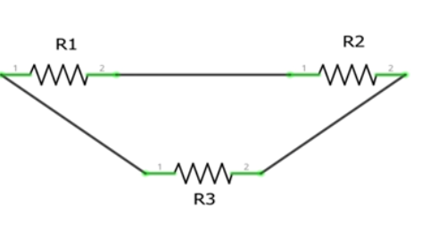

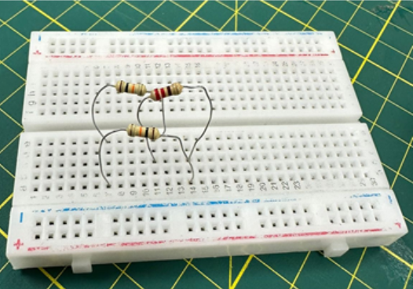

### Calculos:
a) 
- Marrón → 1
- Negro →0
- Naranja →×1000
- Dorado → 5%

= 10 * 1 000

R= 10 000  Ω 

b)
- Rojo →2
- Rojo →2
- Marrón →×10
- Dorado →5%

= 22* 10

R= 220  Ω

### Resultados:
- 10000
- 220

→ 10000 + 220 = 10220

→ 1/10220 +1/10000 =1,97 x 10*-4

→R=(1,97 x 10*-4)*-1 = 5054 Ω =R

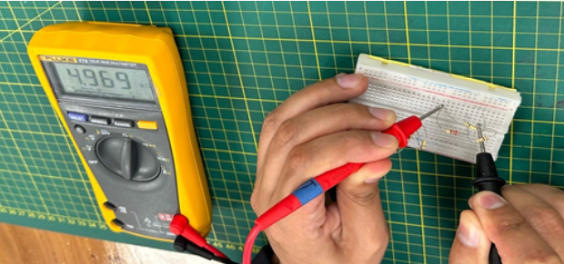

## EJERCICIO 2:  NIVEL GATO:

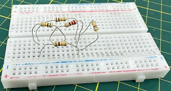

La Resistencia en R1, R2, R4 y R5, está dado por los siguientes colores y se encuentran en serie:

- Marrón → 1 
- Negro →0 
- Naranja →×1000
- Dorado → 5%

= 10 * 1 000

I= 10 000  Ω 

La Resistencia en R3, tiene los siguientes colore:

- Rojo → 2
- Rojo → 2
- Marrón →×1000
- Dorado → 5%

= 22* 10

 
R= 220  Ω

Los resistores en paralelo R2 y R3 se suman:

= 10 000 + 220= 10 220

Los resistores en serie sumamos: =1/1+1/23+1/4 

1/10 000+1/10220+ 1/10000= 2.978473 x  10-4

Invertimos: 
1/2.978473 x  10-4= 3357.425

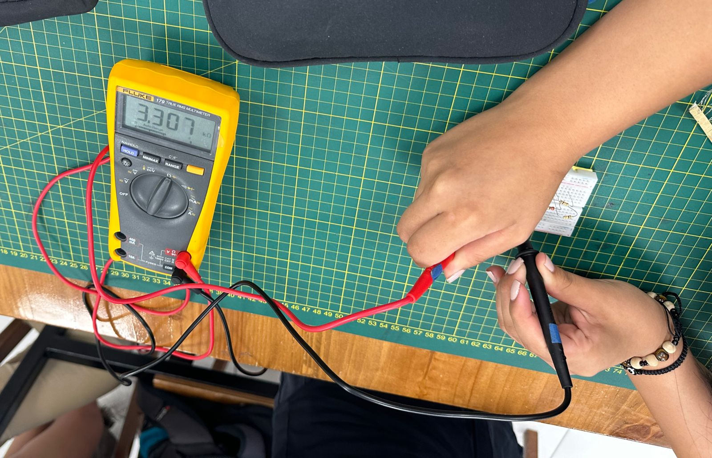

## EJERCICIO 3: NIVEL DRAGON

La Resistencia en R1, R2, R3,  R4, R5 y R6, está dado por los siguientes colores y se encuentran en serie:

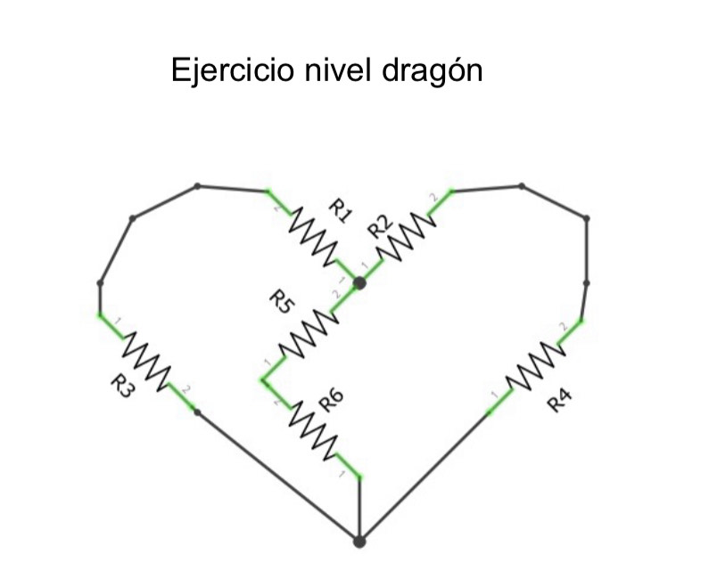

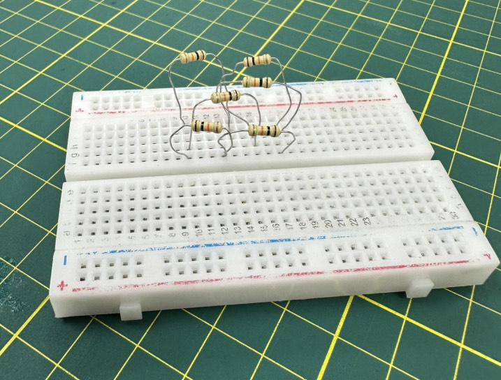

La Resistencia en R1, R2, R3,  R4, R5 y R6, está dado por los siguientes colores y se encuentran en serie:

- Marrón → 1 
- Negro →0 
- Naranja →×1000
- Dorado → 5%

= 10 * 1 000

I= 10 000  Ω

Los resistores en paralelo  R5 y R6:

= 1/10000+1/10000= 1/20000

Los resistores en paralelo  R1 y R3:

= 1/10000+1/10000= 1/20000

Los resistores en paralelo  R2 y R4:

= 1/10000+1/10000= 1/20000

<b>Entonces:</b> =1/20000+1/20000+1/20000= 3/20000/p>

R=6666,66

## EJERCICIO 4:

Una aplicación común sería la reducción de una señal digital con nivel de tensión
de 5V a 1V1.

EJERCICIO REALIZADO POR EL GRUPO:

- 1.1V=5V(R2R1+R2)
- 1.1(R1+R2)=5(R2)
- 1.1R1=3.9(R2)
- R1=3.54(R2)
- Aproximación:
- R1=3 (R2)
- R2=1

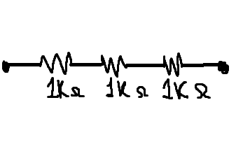

- Dato de salida:
- V=1.2

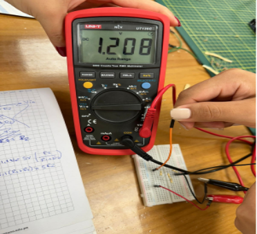

- Circuito:

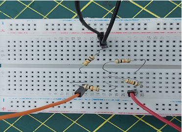

EJERCICIO CORREGIDO:

- 1.1V=5V(R2R1+R2)
- 1.1(R1+R2)=5(R2)
- 1.1R1=3.9(R2)
- R1=3.54(R2)
- Aproximación:
- R1=3.5(R2)
- R2=1

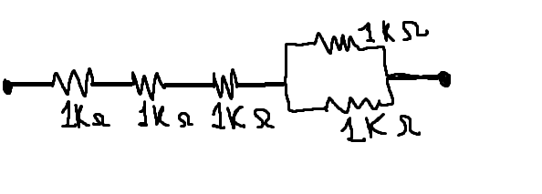

- Circuito:

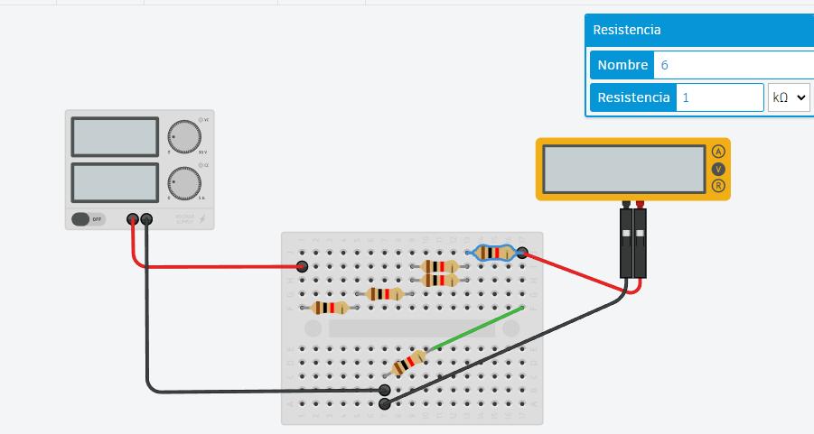

