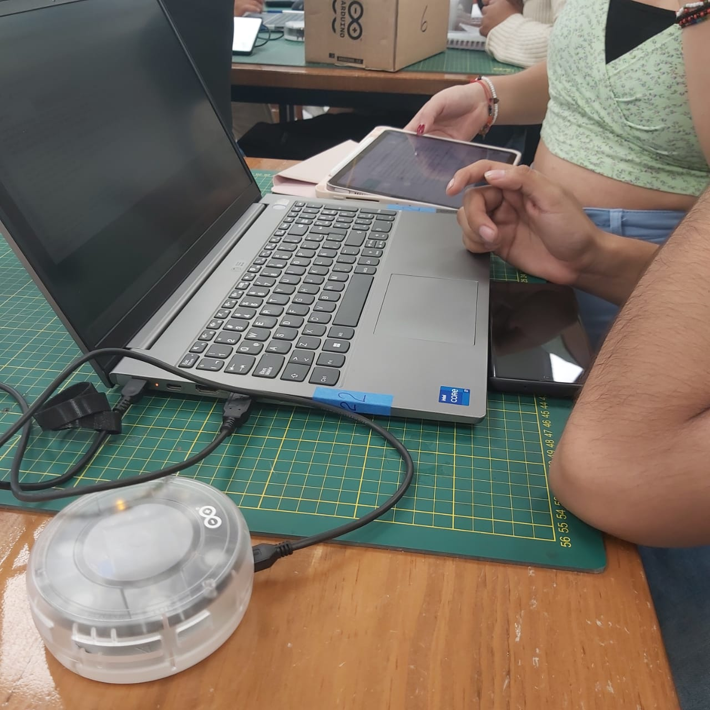
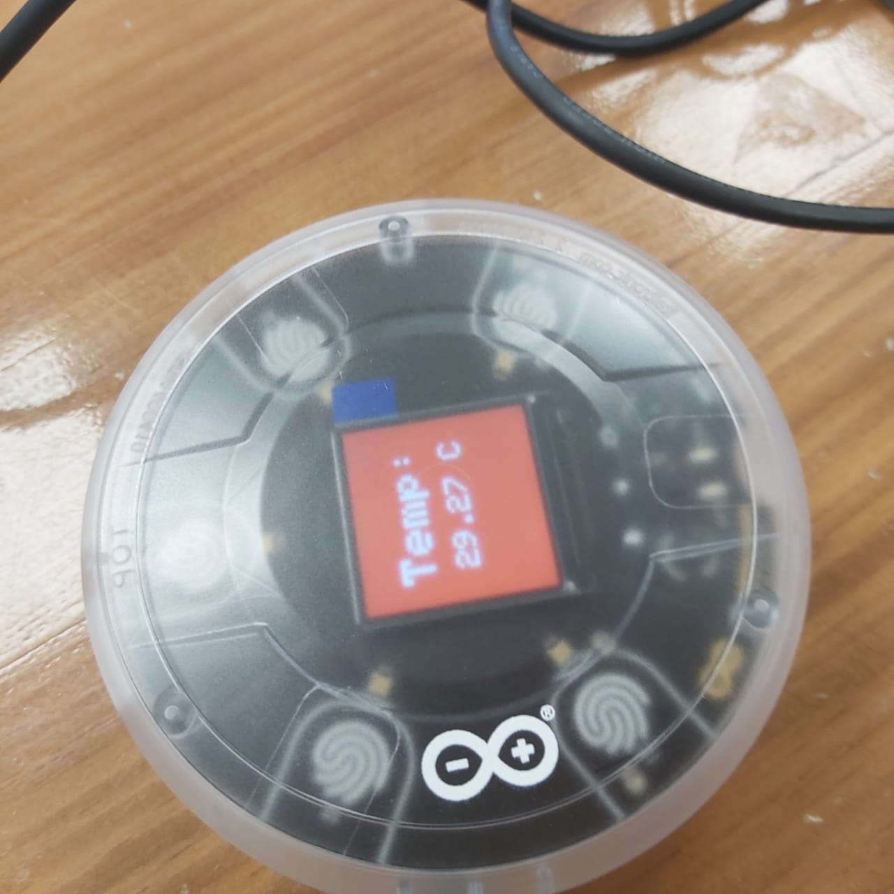

# INFORME DEL TALLER
## INTRODUCCION

El Internet de las Cosas (IoT) representa una red extensa de dispositivos conectados globalmente, recopilando y compartiendo datos. Su fundamentación se basa en la capacidad de marcar digitalmente cualquier objeto y conectarlo a una red global, como Internet. Este enfoque transforma la computación hacia un paradigma distribuido, donde la interconexión de entidades como lámparas, teléfonos, automóviles y más, genera una red de comunicación.

La comunicación entre estos dispositivos se realiza mediante diversas tecnologías y protocolos, facilitando el intercambio de información a través de Internet. Las aplicaciones del IoT varían desde controlar una simple bombilla con un teléfono hasta implementar sistemas complejos como la gestión de residuos. La naturaleza descentralizada de la computación en este contexto se combina con la centralización de datos, donde la información se comparte y procesa en infraestructuras centralizadas. Este entorno interconectado tiene un impacto significativo en la vida diaria, mejorando la eficiencia y la funcionalidad de diversos aspectos, desde el hogar hasta la gestión urbana.

Las redes de objetos conectados, o Internet de las Cosas (IoT), encuentran aplicación en diversos dominios gracias a la reducción de costos y tamaños de dispositivos, el avance tecnológico y un mayor acceso a Internet Fábricas conectadas, monitorización de vehículos, control de edificios y el futuro de la atención médica.

## LAS HERRAMIENTAS INCLUIDAS SON: 

Arduino MKR WiFi 1010 y MKR IoT Carrier: Proporciona hardware esencial para la implementación de proyectos IoT y Arduino Cloud, se integra con la plataforma en línea de Arduino Cloud, que permite programar la placa, conectar dispositivos, explorar proyectos en Arduino Project Hub y gestionar placas de forma remota a través de Arduino Device Manager.

## PRIMER EJERCICIO:

Durante este ejercicion tuvimos que realizar diferentes actividades como, el ensamblaje del kit  en el cual encajamos Arduino MKR WiFi 1010 en la base MKR IoT Carrier 

Luego conectamos el arduino a nuestra Laptop  y compilamos el codigo obtenido en arduino cloud en nuestro Arduino MKR mediante un editor de arduino en linea previamente sincronizados 

Al correr el codigo nuestro arduino arrojaba datos tanto de la humedad (Como porcentaje) como de la temperatura (En grados celcius) en el ambiente y los mostraba en su pantalla

## SEGUNDO EJERCICIO:

En este ejercicio modificamos el codigo obtenido de Arduino Cloud para que en el momento de pulsar los diferente Touch de el MKR IoT Carrier la unidad de medida de la temperatura cambia entre Kelvin , Celcius y Fahrenheit 

Para lograr esto creamos diferentes condicionales para que funciones en reaccion con cada touch y al momento de accionar el touch una funcion la cual transformara la temperatura entre  Kelvin , Celcius y Fahrenheit comenzara a funcionar dependiendo del touch accionado

<pre>
  <code>
    if (carrier.Buttons.onTouchDown(TOUCH0)) {
    printTemperatureCelsius();
  }
  if (carrier.Buttons.onTouchDown(TOUCH1)) {
    printHumidity();
  }
  if (carrier.Buttons.onTouchDown(TOUCH2)) {
    printTemperatureKelvin();
  }
  if (carrier.Buttons.onTouchDown(TOUCH3)) {
    printTemperatureFahrenheit();
  }
  </code>
</pre>

<h3>El codigo para la funcion para Celcius </h3>
<pre>
  <code>
  void printTemperatureCelsius() {
  carrier.display.fillScreen(ST77XX_RED);
  carrier.display.setTextColor(ST77XX_WHITE);
  carrier.display.setTextSize(6);
  carrier.display.setCursor(30, 50);
  carrier.display.print("Temp: ");
  carrier.display.setTextSize(4);
  carrier.display.setCursor(40, 120);
  carrier.display.print(temperature);
  carrier.display.print(" C");
} 
  </code>
</pre>

<h3>El codigo para la funcion para Kelvin </h3>
<pre>
  <code>
  void printTemperatureKelvin() {
  float temperatureKelvin = temperature + 273.15;  // Convertir a Kelvin
  carrier.display.fillScreen(ST77XX_GREEN);
  carrier.display.setTextColor(ST77XX_WHITE);
  carrier.display.setTextSize(6);
  carrier.display.setCursor(30, 50);
  carrier.display.print("Temp: ");
  carrier.display.setTextSize(4);
  carrier.display.setCursor(40, 120);
  carrier.display.print(temperatureKelvin);
  carrier.display.print(" K");
}
  </code>
</pre>

<h3>El codigo para la funcion para Fahrenheit</h3>
<pre>
  <code>
  void printTemperatureFahrenheit() {
  float temperatureFahrenheit = (temperature * 9.0 / 5.0) + 32.0;  // Convertir a Fahrenheit
  carrier.display.fillScreen(ST77XX_BLUE);
  carrier.display.setTextColor(ST77XX_WHITE);
  carrier.display.setTextSize(6);
  carrier.display.setCursor(30, 50);
  carrier.display.print("Temp: ");
  carrier.display.setTextSize(4);
  carrier.display.setCursor(40, 120);
  carrier.display.print(temperatureFahrenheit);
  carrier.display.print(" F");
}
  </code>
</pre>

## TERCER EJERCICIO:

Para el tercer y ultimo ejercicio tuvimos que programar el arduino de manera que al medir la temperatura encienda los leds RGB del MKR IoT Carrier , si la temperatura es alta los led deben encender de color rojo mientras que si la temperatura era baja deben encender los led de color azul , ademas debemos conectar un sensor de proximidad el cual al detectar movimiento debe hacer que las luces cambien a verde 

El primer paso que realizamos fue crear un condicional con la temperatura en la cual cuando esta sobrepase cierto valor en este caso usamos 25 grados celcius se encendera todos los led de color rojo y en caso que la temperatura se encuentre e por debajo de 25 los led se mantendran de color azul 

<h3>Codigo para el color de los led</h3>
<pre>
  <code>
    if (temperature > 25) {
    // Primer pixel, rojo
    carrier.leds.setPixelColor(0, 255, 0, 0);
    carrier.leds.setPixelColor(1, 255, 0, 0);
    carrier.leds.setPixelColor(2, 255, 0, 0);
    carrier.leds.setPixelColor(3, 255, 0, 0);
    carrier.leds.setPixelColor(4, 255, 0, 0);
  } else {
    // Primer pixel, azul
    carrier.leds.setPixelColor(0, 0, 0, 255);
    carrier.leds.setPixelColor(1, 0, 0, 255);
    carrier.leds.setPixelColor(2, 0, 0, 255);
    carrier.leds.setPixelColor(3, 0, 0, 255);
    carrier.leds.setPixelColor(4, 0, 0, 255);
  }
    carrier.leds.show();
  </code>
</pre>

# CODIGO COMPLETO

<pre>
  <code>
    
  </code>
</pre>

