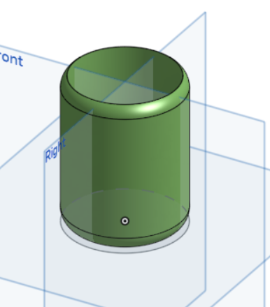
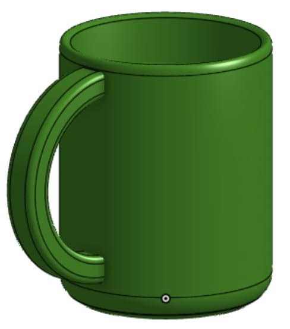
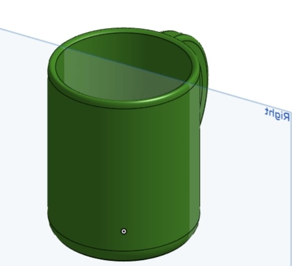
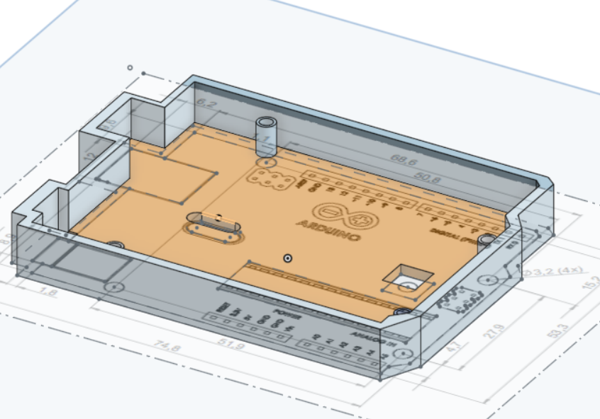
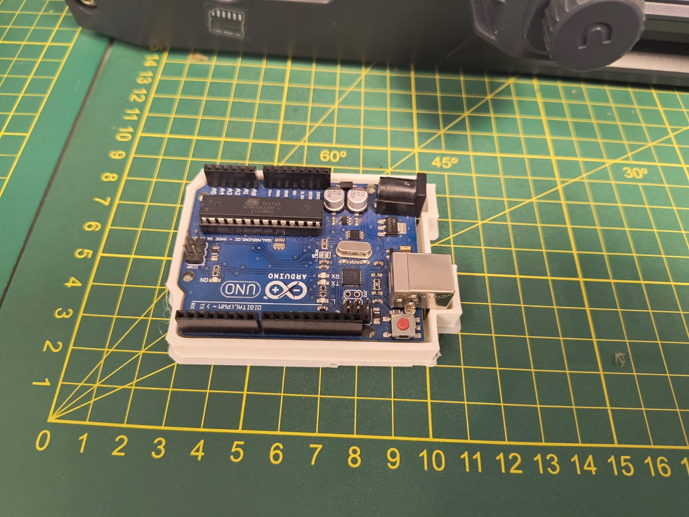
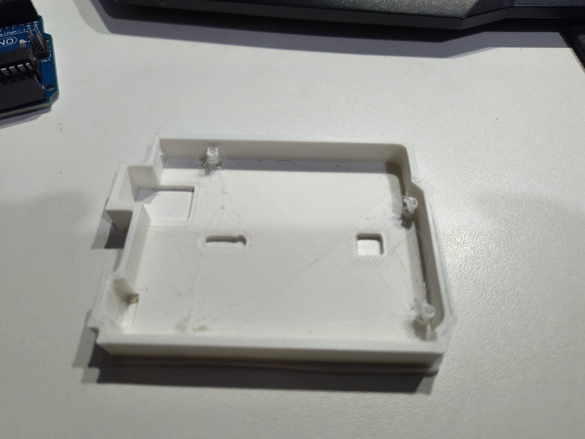

<h1 align="center">MODELADO 3D</h1>

En la clase de hoy, se obtuvieron conocimientos importantes para realizar el modelado en 3D, donde se mencionaron distintos programas para su elaboración, como por ejemplo: Onshape, Autocad, Blender, etc. Pero el que vimos en clase fue Onshape, conocimos las funciones básicas para crear una figura (configurar las medidas en milímetros, seleccionar los planos, mover las figuras, entre otros).  El reto consistió en hacer el modelo de un vaso, una taza y finalmente el case para el arduino que se usará en el proyecto.

Este ejemplo se comenzó fijando la vista en el plano top ocultando los demás planos,luego creamos un sketch en el cual creamos un círculo dentro del plano top este circulo despues lo ajustamos con la herramienta dimensión para ajustar su tamaño a 60mm, posteriormente lo centramos al centro del plano con la herramienta concentric después de marcar el centro del plano y el centro del círculo.Seguidamente, seleccionamos el circulo y aplicamos la herramienta extrude jalar el círculo y darle dimensión de manera que termine como un cilindro para posteriormente usar la herramienta shell para hacer que el cilindro sea hueco y tenga un borde de 3mm. Para finalizar, usar la herramienta fillet para darle borde curvos a las dos caras circulares del cilindro usar edit aparience para cambiar el color del vaso.

Ya estando creado el envase falta la asa para completar la tasa, para la creación de la misma se usó otro sketch donde se utilizó la opción de 3 point arc, para crear un arco en la superficie lateral del envase, donde de la misma forma que el envase se ajustó la dimensión, sin embargo este tuvo el tamaño de 25 mm, en extrude se ajustó su profundidad y su simetría. Se definió después su caras en thicken con las medidas de 6mm y 2mm. Continuando solo se le daría a las esquinas o bordes la opción fillet, los bordes se pondrán redondeados. Por último se le puso la aparience del mismo color que en el envase y listo tenemos nuestra taza

<h2>DISEÑO DE NUESTRO CASE:</h2>

Para el segundo trabajo realizamos un case para un arduino uno. Para comenzar importamos una imagen png de el arduino uno con sus medidas incluidas, esta imagen las colocamos en el plano top y creamos un sketch en el cual creamos líneas siguiendo la imagen pero al mismo tiempo teniendo en cuenta de las medidas en mm del arduino uno, teniendo en cuenta que el arduino uno tiene 4 ranuras circulares  para asegurar el dispositivo con tornillo creamos círculos en los mismo lugares donde se encuentran las ranuras para luego jalarlas hacia arriba con la herramienta extrude creando pilares en los cuales a continuación aplicaremos la herramienta shell para extraer su contenido y dejalos solo con el caparazón con un borde de 1mm para la entrada de los tornillo al momento de asegurar el dispositivo arduino uno.Seguidamente, creamos un contorno a las líneas previamente creadas al borde del arduino uno, seleccionamos el interior de estas y usamos la herramienta extrude para jalarlas hacia arriba , esta parte actuará como el case que protegera al arduino uno .Finalmente, se crearán un rectángulo en la zona lateral para generar una entrada para el cable de alimentación.

<h3>COMPLICACIONES:<h3>

Se tuvo mucha dificultad en el proceso del trabajo, debido al avance rápido y el no poder observar bien las indicaciones, además de ser la primera vez que manejamos un programa de ese tipo.

<h3>COMENTARIOS:</h3>

Onshape ofrece una potente plataforma de modelado 3D basada en la nube que destaca por su accesibilidad, colaboración en tiempo real y sólidas herramientas de modelado para todo tipo de computadoras. 
Por lo que el taller de hoy fue muy enriquecedor para poder realizar nuestro modelado 3D, se aprendió el uso básico de las diferentes herramientas, del mismo modo las recomendaciones para realizar la impresión 3D de forma correcta, para poder evitar desperdiciar el material, y lograr una impresión 3D perfecta.

