<h1>Taller : Esquemático del circuito electrónico</h1>
<h2>Primera Actividad</h2>

Durante este taller usamos la aplicacion Flux AI para realizar nuestros planos electronicos .

Primero comenzamos conociendo el sistemas para lo cual creamos un ejercicio simple en el cual es hacer un plano electrico necesario para encender un diodo led para lo cual necesitamos los siguientes elementos:

<ul>
<li>Un diodo led </li>
<li>Una resistencia generica</li>
<li>Una fuente de poder</li>
</ul>

Al poner Los elementos en la interfaz primero se ajusta la resistencia en la cual se cambia los iniciales 500 ohm a 330 ohm ademas se cambia el package de SDM a H_AXIAL para usar una resistencia con la cual estamos mas acostumbrados a usar

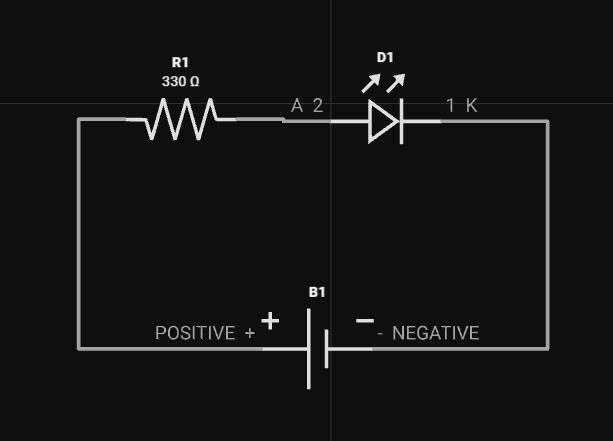

<h2>Segunda Actividad</h2>

Para la segunda actividad tuvimos que crear un circuito de libre eleccion con un minimo de 6 componenetes, para esto nuestro grupo realizo lo siguiente

<h3 align="center">Circuito Electronico</h3>

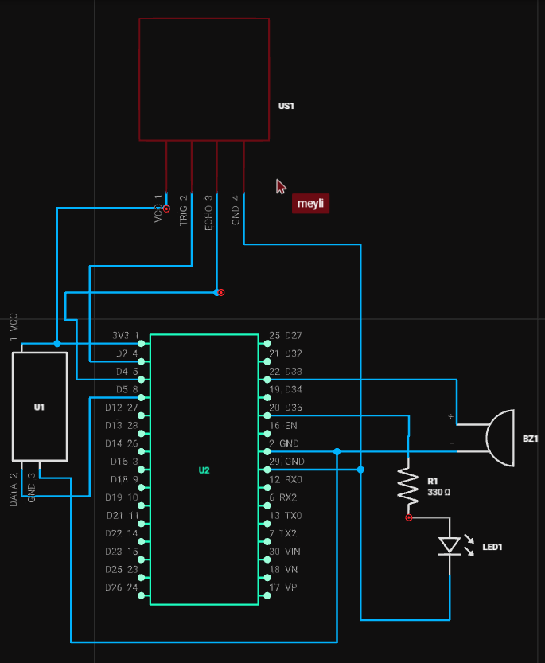

<h3 align="center">Descripcion de Componentes</h3>

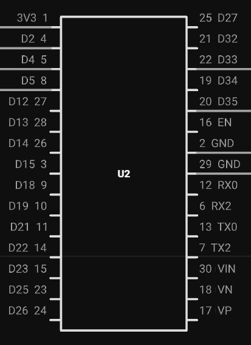
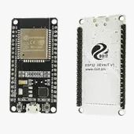

En primer lugar, se hace uso de un procesador ESP32 en nuestro diagrama eléctrico. Este procesador cuenta con conexión a Wi-Fi y Bluetooth y es uno de los procesadores de bajo costo y consumo de energía existentes en el mercado.

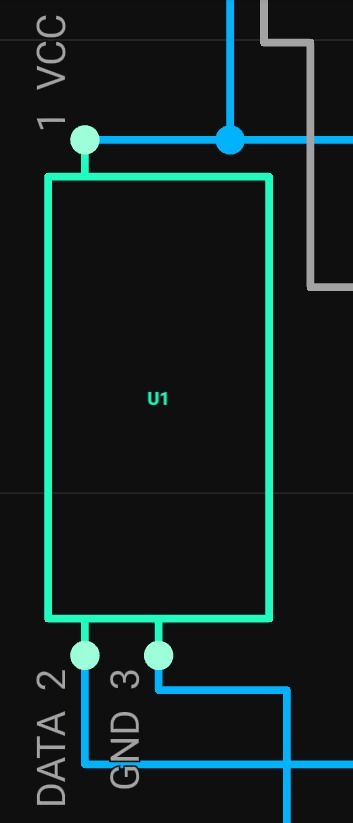
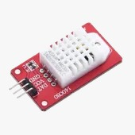

El procesador ESP32 va conectado a un sensor DHT22 que permite monitorear la temperatura y humedad a un bajo costo.

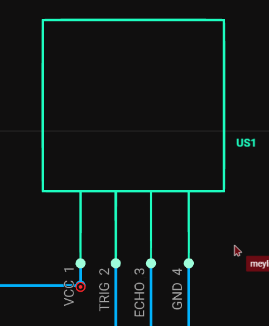
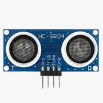

Asimismo, el procesador está conectado a un sensor HC-SR04. Este sensor ultrasónico se emplea para medir la distancia o la proximidad en un rango de 2 a 450 cm.

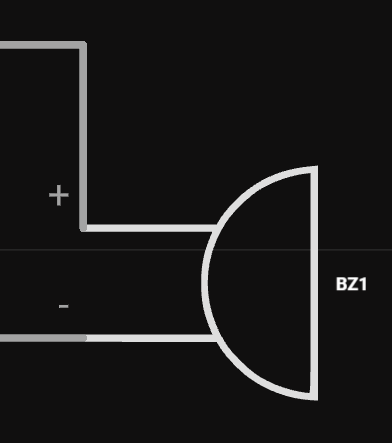

Además, se hizo uso de un Buzzer que permite emitir sonidos puesto que es un indicador audible. Este es capaz de alertar por las señales de la conexión al procesador.

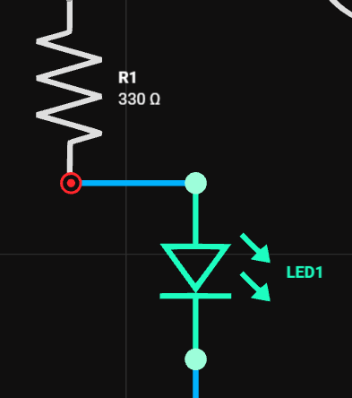
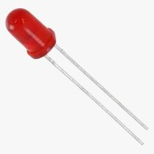

Finalmente, se emplea una luz led en el circuito que va conectado al procesador. Dicha luz está acompañada de una resistencia para evitar que se queme.

