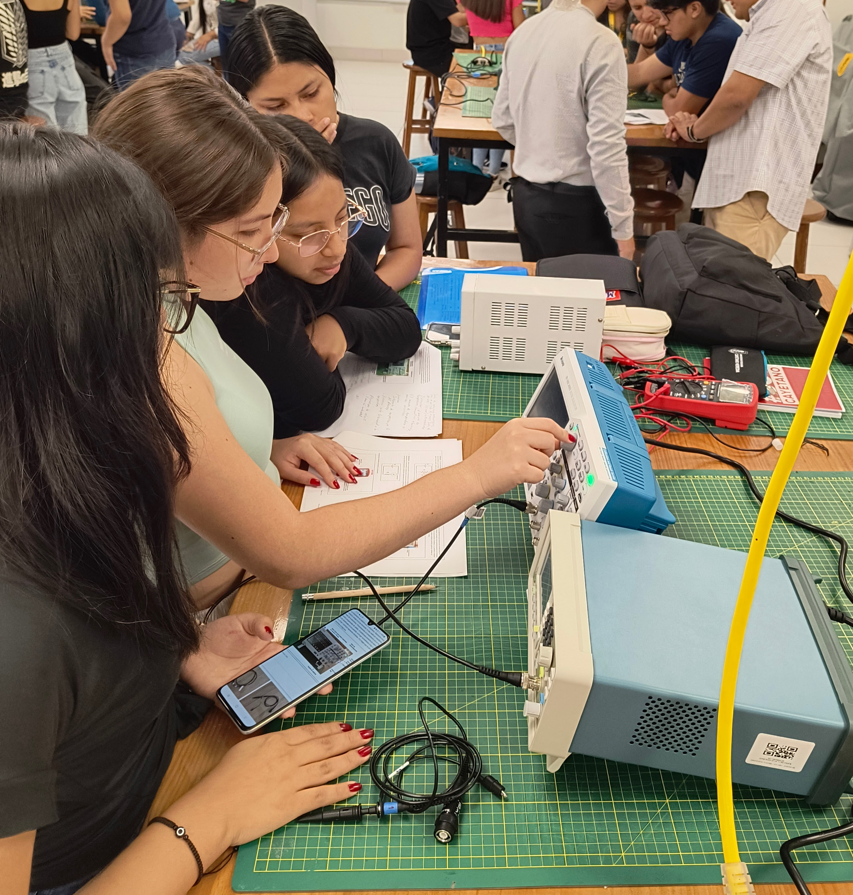

<h1>Informes</h1>
<h2>Informe 1</h2>

La guia N°2, nos proporciona una visión general de los diversos dispositivos y herramientas utilizados en laboratorio. Su objetivo principal es familiarizar a los usuarios con el equipo básico y los instrumentos esenciales para llevar a cabo nuestros experimentos. Se conoció el funcionamento del multímetro digital,  como regular el voltaje de una Fuente de Alimentacion , el Generador de señales y Osciloscopio digital.

<a href="Informe_1.md">Enlace al Informe 1</a>
 
 
<a href="../README.md">Enlace al README  de FdD </a>
 
<a href="../../README.md">Enlace al README  de la pagina principal</a>
