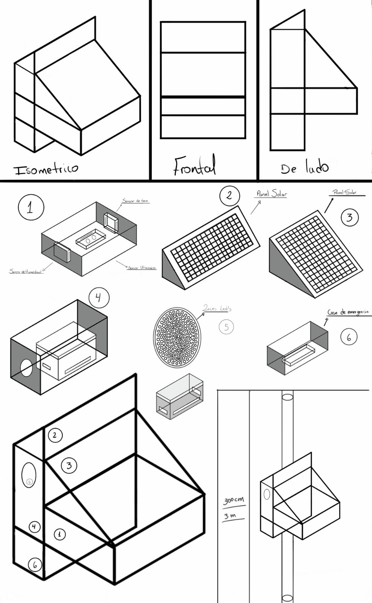
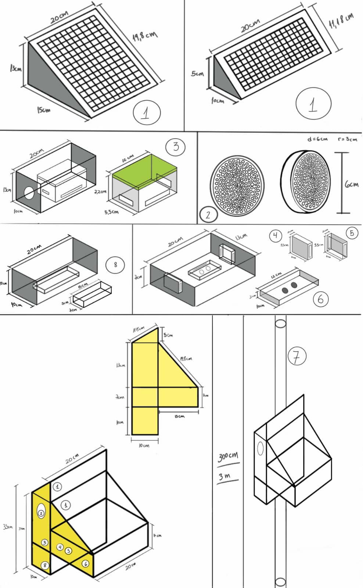

<h1>HARDWARE</h1>
<h2 align="center">MATERIALES<h2>

IMAGEN 1

<h2 align="center">MODELAMIENTO 3D<h2>
<h2 align="center">Proyecto preliminar 1</h2>

IMAGEN 2

<h2 align="center">Medidas del proyecto</h2>

<h2 align="center">Modelado 3D (Partes)</h2>

IMAGEN 3

<a href="https://sketchfab.com/models/0cfd7786ea6c4c309e18a19b6a26dcf2/embed">Link a Modelo 3D</a>(Archivo en carpeta Descargables)

<h2 align="center">Modelado 3D unido</h2>

IMAGEN 4

<a href="https://sketchfab.com/models/520634a8033e4c0790dd191f74689900/embed">Link a Modelo 3D</a>(Archivo en carpeta Descargables)

<a href="/FdD/Entregables/7_Modelo_3D.md">Para mas informacion sobre el modelado 3D click aqui </a>

 
 

<a href="../README.md">Enlace al README de la pagina principal</a>