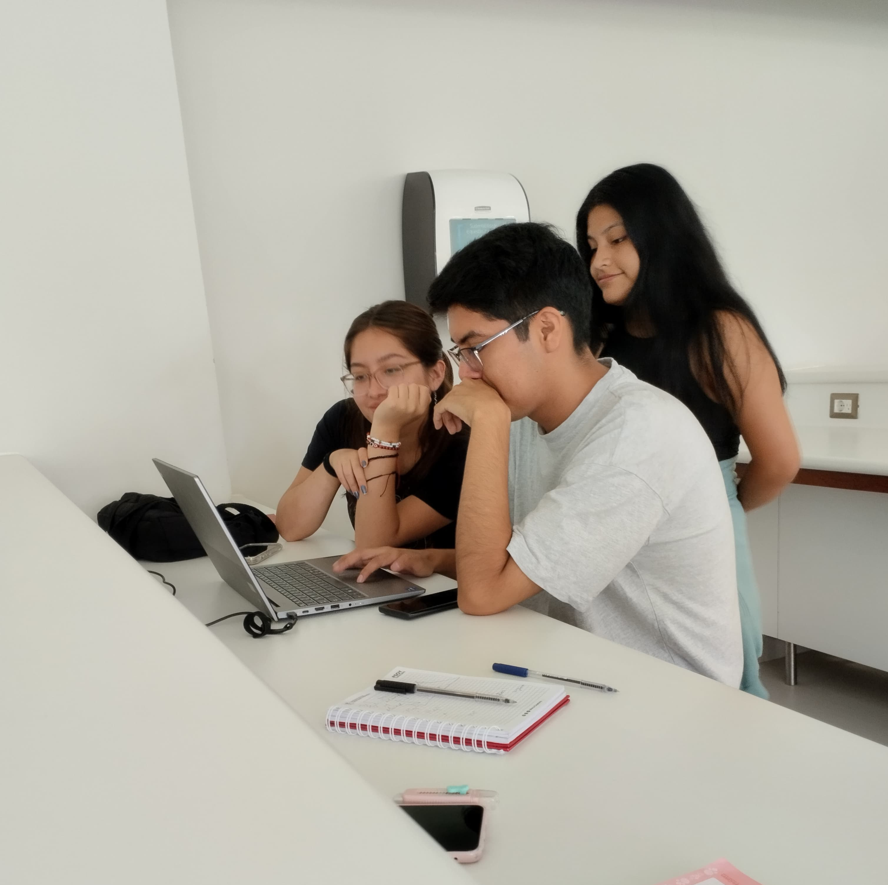

# Grupo 3 Fundamentos de Diseño
## Presentación:
Bienvenidos al repositorio del grupo 3 del curso:"Fundamentos de Diseño"
### Proyecto:
"Resiliencia Climatica: hacia un Futuro Sostenible"
### Objetivo:
Como objetivo se busca desarrollar un modelo de solución sostenible y eco amigable con el medio ambiente, donde se haga uso de inteligencias múltiples que faciliten el desarrollo del proyecto teniendo presente la ODS 13 “Acción por el clima.
## Integrantes:
1. Mirella Solange Bendezu Guerra (mirella.bendezu@upch.pe)
2. Jose Nilson Cueva Ramos (jose.cueva@upch.pe)
3. Meyli Flores Huaman(meyli.flores@uph.pe)
4. Iory Estefani Huarca Astete (iory.huarca@upch.pe)
5. Romina Perez Amado (romina.perez@upch.pe)
## Roles:
- Coordinador General, Pruebas y Calidad (Bendezu, Mirella) 
- Coordinador de Software y Manufactura (Cueva, Jose)
- Coordinador de Diseño y Bocetos (Huarca, Iory)
- Coordinador de Modelado 3D y Testing de Usabilidad (Flores, Meyli)
- Coordinador de Comunicación visual e Interactividad (Perez, Romina)

<h2>Tabla de contenido</h2>
<h2>Tema</h2>
ODS N°13 "ACCIÓN POR EL CLIMA"

 
Objetivos específicos de la ODS Nº13
<ul>
<li>Integrar medidas sobre el cambio climático en las decisiones políticas, estrategias y planes de desarrollo.</li>
<li> Integrar medidas sobre el cambio climático en las decisiones políticas, estrategias y planes de desarrollo.</li>
</ul>
 
<ul>
<li>Naciones Unidas. (2015). Transformar nuestro mundo: La Agenda 2030 para el Desarrollo Sostenible </li>
<li>Valencia, M. F., Le Coq, J. F., Favareto, A., Samper, M., Saenz Segura, F., & Sabourin, E. (2019). Hacia una nueva generación de políticas públicas para el desarrollo territorial rural en América Latina</li>   
<li>Garcia, M. B., & Moran, M. (2018, agosto 6). Cambio climático. Desarrollo Sostenible.</li>
</ul>
